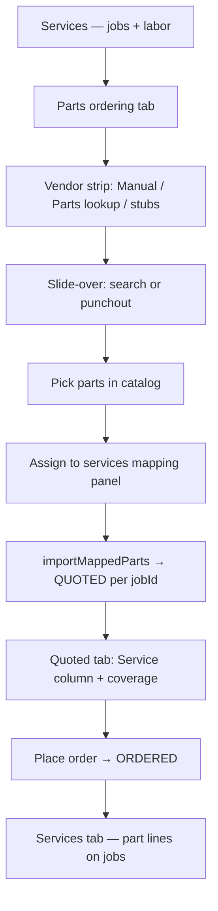

# AutoLeap service → parts ordering flow audit

**Video:** `8C49DC7F-4CD7-4BE0-B8E2-03B1B721AD8F.MP4` (~182s)  
**Screenshots:** `docs/audits/screenshots/autoleap-order-flow-2026-07-05/frame-*.jpg`  
**ShopRally surface:** Estimate building lab (`/design-review/estimate-building?ro=…`) — Dev :3004  
**Date:** 2026-07-05

---

## Executive summary

**Verdict: ShopRally can run this flow today** for the core advisor path (services → PartsTech lookup → assign to jobs → quoted → place order → services reflect lines). The estimate lab already mirrors AutoLeap’s tab split, vendor strip, Service column, and multi-part mapping after punchout.

**Not yet parity:** tab badge count, vendor-grouped cart sections, PO# pre-fill in PartsTech, sync/modify/update cart actions, Services-tab procurement badges, overwrite-on-sync modal, and richer ordering-table columns (list/core/delivered).

---

## AutoLeap flow (step-by-step from video)

RO **#10249** — 2014 Honda Accord EX-L. Advisor builds estimate, sources parts via PartsTech, assigns each line to a service job, then places one vendor order.

| Step | Time (approx) | Screen | What happens |
|------|---------------|--------|--------------|
| 1 | 0:00 | Services | Empty estimate; **+ Browse** canned services / **+ Service** |
| 2 | 0:08 | Canned services modal | Pick **ABS System Diagnosis & Testing** (MOTOR / AutoLeap catalog) → labor lands on Services |
| 3 | 0:16 | Services | Job card with labor only; no parts yet |
| 4 | 0:24 | Parts ordering | Vendor strip: Manual + **PartsTech (Connected)** + stub vendors |
| 5 | 0:32 | PartsTech punchout | Search pre-filled with **service name**; “Did you mean?” suggestions → search **ABS** → pick **ALS2402** wheel speed sensor → cart |
| 6 | 0:40 | PartsTech cart | PO field **10249-201** (RO-derived); **Submit quote** |
| 7 | 0:48 | Services | Part nested under ABS job; badges **PartsTech · Available · Unordered** |
| 8 | 0:56 | Parts ordering (1) | Tab badge **(1)**; **PartsTech’s orders** section `10249-201`; table row with **Service = ABS System** |
| 9 | 1:04 | Services | Add **Stabilizer Bar Link Kit R&R** job |
| 10 | 1:12 | Services inline | Type dropdown → **Part - PartsTech** on job row → opens catalog |
| 11 | 1:20 | PartsTech | Search **Stabilizer Bar**; add Delphi link; cart may span **multiple suppliers** (Fisher + Factory Motor Parts) |
| 12 | 1:28 | Services | Two jobs each show quoted parts + **Unordered** badges; tab **Parts ordering (2)** |
| 13 | 1:36 | Services | Third job / bulb line via catalog (**Turn Signal Light Bulb**, qty 2) |
| 14 | 1:44 | Services | Three unordered parts; tab **Parts ordering (3)** |
| 15 | 1:52 | Parts ordering | All lines in one PartsTech cart; **Service** dropdown per row (reassign / **Unassign service**); status **Unordered** |
| 16 | 1:58 | Parts ordering | **Place order** → line status **Ordered** |
| 17 | 2:02 | Modal | **Overwrite service line** — sync vendor name/price/description back to Services (optional) |

### AutoLeap status vocabulary

| AutoLeap badge | Meaning in video | ShopRally equivalent |
|----------------|------------------|-------------------|
| **Unordered** | In PartsTech cart / quoted, not PO’d | `PartStatus.QUOTED` |
| **Ordered** | PO submitted | `PartStatus.ORDERED` |
| **Available** | Supplier stock signal | Not modeled (display-only) |
| **PartsTech** | Vendor source | `partLine.vendor` + integration flag |

AutoLeap does **not** expose a separate “Needed” bucket on the ordering tab; parts appear on Services as soon as they’re quoted from PartsTech. ShopRally keeps an explicit **NEEDED** state for manual placeholders before vendor quote.

---

## ShopRally mapping (current implementation)

| AutoLeap step | ShopRally today | Match |
|---------------|--------------|-------|
| Services tab with job cards | `estimate-lab-jobs-list` → `EstimateJobCard` | ✅ |
| Parts ordering tab | `estimate-lab-work-tabs` + `estimate-lab-parts-tab` | ✅ |
| Horizontal vendor strip | `estimate-lab-parts-vendor-strip.tsx` | ✅ |
| PartsTech punchout | `startPunchout` + `/api/partstech/return` → mapping | ✅ (no auto single-job import) |
| Service-scoped lookup | `openPartsMenu({ jobId, mode: 'lookup' })` | ✅ |
| Multi-part → multi-job assign | `estimate-lab-parts-mapping-panel` + `importMappedParts` | ✅ |
| Service column reassignment | `EstimateLabServiceSelect` + `reassignPartLineJob` | ✅ |
| Place order | `markPartsOrdered` on Quoted tab | ✅ |
| Parts nested under jobs on Services | `job.partLines` in job card | ✅ |
| Tab badge **Parts ordering (N)** | Static label only | ❌ |
| Vendor cart section + PO **10249-201** | Single flat table | ❌ |
| Sync / Modify / Update details | — | ❌ |
| Services line badges (PartsTech / Unordered) | Part rows show pricing only | ❌ |
| Inline **Part - PartsTech** type row | Split **Add part** / lookup from job menu | ⚠️ partial |
| **Order part(s)** link on line | Job menu → lookup | ⚠️ partial |
| Overwrite modal after sync | — | ❌ |
| List price / Core / Delivered columns | Cost + qty + amount only | ❌ |
| Unassign service | Always requires a jobId | ❌ |

**Key files:** see `agents/EstimateBuilding/PARTSTECH-FLOW.md` and `PARTS-JOB-ASSIGNMENT.md`.

---

## Gap analysis (priority)

### P0 — Flow works without these; advisor can complete RO

Already satisfied. Run test checklist in `PARTSTECH-FLOW.md`.

### P1 — Visible AutoLeap parity (recommended next)

| Gap | Why it matters | Suggested fix |
|-----|----------------|---------------|
| **Parts ordering tab badge** | Advisor sees pending count without opening tab (video: 1→2→3) | Pass `hubParts.filter(QUOTED).length` (or NEEDED+QUOTED) into `EstimateLabWorkTabs`; render `(N)` on parts tab |
| **Services tab part status badges** | Same-tab visibility of Unordered/PartsTech while editing estimate | On lab job card part rows, read `partLine.status` + `vendor`; render compact pills (Quoted/Unordered, vendor) |
| **PO number in punchout** | PartsTech cart shows `RO#-seq` for supplier PO tracking | Generate `{roNumber}-{cartSeq}` in `startPunchout` / session create; pass to PartsTech API when supported |
| **Pre-fill PartsTech search from job** | Video searches service name immediately | Pass job name as initial query param in punchout URL or slide-over search when `jobId` set |

### P2 — Power-user / live PartsTech parity

| Gap | Suggested fix |
|-----|---------------|
| **Vendor-grouped sections** (“PartsTech’s orders”, sub-supplier headers) | Group `hubParts` by `vendor` / session id in pipeline table |
| **Sync order / Modify order / Update details** | Wire to PartsTech session APIs + `fetchPartsTechSessionQuote`; refresh QUOTED lines |
| **Overwrite service line modal** | After sync, diff vendor vs estimate line; optional `updatePartLineFromVendor` action |
| **Unassign service** | Allow null job only in mapping UI with validation before place order |
| **List / Core / Delivered columns** | Extend table when PO/receiving fields exist on `PartLine` |

### P3 — Nice-to-have

- Manual ordering modal grouped by job (qty on service vs qty to order) — from earlier AutoLeap video
- Connection state tiles for Nexpart / RepairLink / TireHub (stubs exist)
- “Last synced” timestamp on cart header

---

## Terminology alignment (for UX copy)

| Show advisors | When |
|---------------|------|
| **Unordered** or **Quoted** | `QUOTED` — in vendor cart, ready to place order |
| **Ordered** | `ORDERED` |
| **Needed** | `NEEDED` — placeholder on estimate, not yet quoted (ShopRally-only; keep for manual workflow) |

Avoid showing both “Quoted” and “Unordered” for the same state unless toggled in Settings later.

---

## Test script (validate against video flow)

Use mock catalog or live PartsTech on estimate lab with RO that has **≥2 named services**.

1. Add **ABS System**-style job + **Stabilizer Bar** job on Services.
2. Parts ordering → **Parts lookup** → search/add sensor → **Assign to services** → map to ABS job → Save.
3. From Stabilizer job card → **Parts lookup** → add link part → map to Stabilizer job.
4. Parts ordering **Quoted** — confirm **3** lines (or 2), Service column correct; reassign one line via dropdown.
5. Select all → **Place order** → **Ordered**; Services tab shows parts on correct jobs.
6. Quick reference counts (`partsQuoted` / `partsOrdered`) update.

---

## Conclusion

ShopRally’s estimate lab is **architecturally aligned** with the AutoLeap video: dual-tab model, vendor-first ordering UI, mandatory job assignment, and punchout → map → quote → place order. No blocker prevents using this workflow in production RO editing once the lab ships to the main estimate tab.

**Highest-value follow-ups:** tab badge count, Services-tab status badges, and PO/search pre-fill — these close the biggest UX gaps visible in the video without new backend domains.
