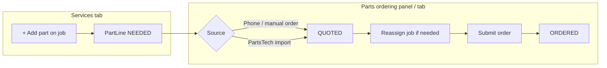

# Parts → Job Assignment (Tekmetric + AutoLeap → ShopRally)

**Videos analyzed:** 2026-07-05  
**Screenshots:** `docs/audits/screenshots/parts-assign-videos-2026-07-05/`

| Source | File | Key behavior |
|--------|------|--------------|
| Tekmetric PartsHub | `D25F0F07-…MP4` | Needed → Quoted → Ordered pipeline; **Job assignment** dropdown on Quoted tab before submit |
| AutoLeap | `B7504AC5-…MP4` | Parts on service jobs; **Parts ordering** tab groups manual order by job (qty on service / qty to order) |

---

## Best-practice model (ShopRally)

### Status pipeline

| Status | Meaning | How lines get here |
|--------|---------|-------------------|
| **NEEDED** | On estimate, not yet quoted/ordered | `addPartLine` from job card inline **+ Add part** |
| **QUOTED** | Priced with supplier; ready to PO | `addPhoneOrderPart`, PartsTech `importMappedParts` |
| **ORDERED** | PO submitted | `markPartsOrdered` from Quoted tab |

Every `PartLine` has a required `jobId` — parts always belong to a service job.

### UI surfaces (AutoLeap-inspired tab)

1. **Services tab** — part lines nested under each job; status badges on lines
2. **Parts ordering tab**
   - **Vendor strip** — horizontal tiles: Manual ordering, Parts lookup, wholesale stubs (connection dot + action)
   - **Status pills** — Needed | Quoted | Ordered
   - **Order table** — Item | Item # | Qty | Amount | **Service** (dropdown) | Vendor | Status
   - **Place order** — green button on Quoted tab (select lines first)
3. **Parts slide-over** — vendor rail + compact pipeline (same Service column)

### Job assignment rules

- **Bulk vendor order (4–5 parts):** all lines land on Quoted; advisor assigns each row via **Service job** dropdown before Submit order (Tekmetric PartsHub)
- **Needed tab:** same job dropdown — move parts between jobs before quoting
- **No single-job filter** on the tab — every part visible RO-wide so mixed-job orders are obvious
- **Services tab sync:** `reassignPartLineJob` moves the line; Services grid reflects the new job on refresh

---

## Implementation map

| File | Role |
|------|------|
| `src/lib/hub-parts.ts` | `HubPart` type + `buildHubParts(jobs)` |
| `estimate-lab-parts-vendor-strip.tsx` | AutoLeap-style horizontal vendor tiles |
| `estimate-lab-parts-pipeline.tsx` | Status pills + order table with Service column |
| `estimate-lab-parts-menu.tsx` | Slide-over home = pipeline; vendor flows for lookup / phone order |
| `estimate-lab-parts-tab.tsx` | Parts ordering tab: compact pipeline + vendor buttons |
| `estimate-lab-parts-provider.tsx` | `hubParts` + `openPartsMenu({ jobId, mode })` |
| `server/actions/estimate.ts` | `reassignPartLineJob` |
| `server/actions/partstech.ts` | `addPhoneOrderPart`, `importMappedParts`, `markPartsOrdered` |

---

## Test checklist

1. Add part on Services job → appears under **Needed** in Parts tab + slide-over
2. Phone order from Parts tab → line moves to **Quoted** on correct job
3. PartsTech import → **Quoted** with supplier + PN
4. On Quoted tab, change job assignment → line moves to other job on refresh
5. Select quoted lines → **Submit order** → **Ordered**
6. Quick Reference counts (`partsNeeded` / `partsQuoted` / `partsOrdered`) update
