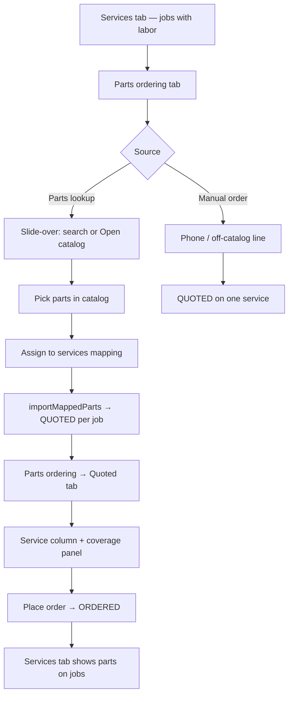

# PartsTech ordering flow (estimate lab)

End-to-end path from estimate → vendor → services → place order.

## Flow

## Steps (advisor)

1. **Services** — create jobs (e.g. Brakes, Suspension) with labor lines.
2. **Parts ordering** → **Parts lookup** (or job card **Parts** button).
3. **Search** sample/live catalog **or** **Open catalog** (live punchout).
4. Select parts → **Assign N parts to services**.
5. **Mapping screen** — each line: Add to service (dropdown lists jobs; “needs parts” first) or Replace existing line.
6. **Save** → parts appear as **Quoted** on Parts ordering tab and on **Services** under assigned jobs.
7. **Quoted** tab — confirm **Service** column; use coverage panel to spot jobs missing parts.
8. Select lines → **Place order** → **Ordered**.

## Punchout return (live PartsTech)

- `startPunchout` opens catalog with vehicle + return URL.
- Advisor **Submit quote** in PartsTech → `/api/partstech/return` fetches quote.
- Return page `postMessage`s `partstech-quote` to opener — **no auto-import to one job**.
- Slide-over opens **Assign to services** mapping.

## Key files

| File | Role |
|------|------|
| `estimate-lab-parts-tab.tsx` | Vendor chips + pipeline |
| `estimate-lab-parts-menu.tsx` | Slide-over: search, punchout listener, mapping |
| `estimate-lab-parts-mapping-panel.tsx` | Per-part service assignment |
| `estimate-lab-parts-pipeline.tsx` | Quoted / Place order |
| `estimate-lab-services-coverage.tsx` | Jobs vs assigned quoted parts |
| `api/partstech/return/route.ts` | Quote fetch → postMessage |
| `server/actions/partstech.ts` | `importMappedParts`, `markPartsOrdered`, `fetchPartsTechSessionQuote` |

## Test (mock catalog)

1. Open estimate lab with ≥2 services.
2. Parts lookup → search “pad” → select 2–3 parts.
3. **Assign to services** → map Pads/Rotors to Brakes, Strut to Suspension → Save.
4. Parts ordering **Quoted** — verify coverage + Service dropdowns.
5. Place order → **Ordered**; Services tab shows lines on correct jobs.
