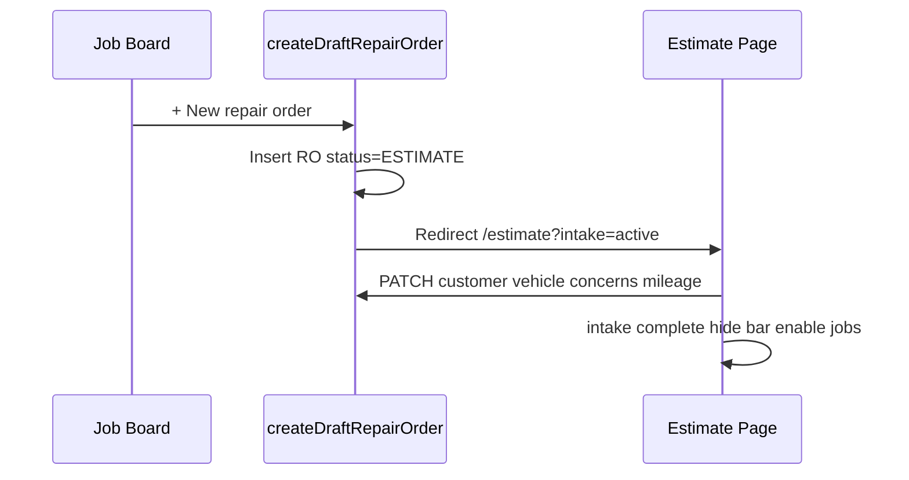

# ShopRally estimate-first intake — fresh design (v2)

**Date:** 2026-07-05  
**Status:** Design only — Order Process Lab (does not change dev until approved)  
**Reference video:** `8EEE20F8-A5C0-48C7-8B86-96315F1469F9.MP4` (SnagIt — competitive research)  
**Related:** `2BBF85F0…` (AutoLeap work board → estimate), `7ABF2D71…` (Tekmetric full intake)

---

## Start fresh — what we are solving

Advisors want **speed**: one action from the job board and they are **already on the estimate workspace**, building a quote—not filling a separate wizard first.

AutoLeap achieves this by assigning an RO/estimate number immediately and keeping identity capture **inside** the estimate screen.

**ShopRally goal:** Same *speed*, different *expression* — plus Tekmetric-grade completeness (concerns, odometer, guardrails) before the first job line is quoted.

---

## Copyright & originality (safe to build)

| Generally **not** protected | **Do not copy** from competitors |
|------------------------------|-----------------------------------|
| Landing on estimate after “new order” | Exact button labels (“+ Estimate”, their product names) |
| Draft RO number shown early | Pixel-identical layout, colors, iconography |
| Customer search on estimate screen | Their marketing phrases and help copy |
| Inline modals for customer/vehicle | Unique branded UI assets / screenshots |
| Industry patterns (job board, services tab, sticky totals) | Passing off their demo as ShopRally’s |

**ShopRally owns:**
- ShopRally brand (charcoal `#1A1C22`, blue `#00A3FF`)
- **“Estimate-first shell”** naming and our progress checklist
- **Identity bar** (single smart search—not competitor search-pill strip)
- Tekmetric-style **concern chips + duplicate RO warnings** on our chrome
- `CrmFormSection` / `CrmDialogShell` subforms (already distinct)

We take **ideas** from shop software common practice; we implement **ShopRally UI and flow**.

---

## ShopRally flow: Estimate-first shell

### v1 lab (deprioritize)
```
Job board → slide-over intake sheet (4 steps) → Create → redirect estimate
```

### v2 (recommended — default assumptions)
```
Job board → [+ New repair order]
         → server creates DRAFT RO (status ESTIMATE, number assigned)
         → /repair-orders/{id}/estimate?intake=active
         → Estimate workspace IMMEDIATELY (Services visible but soft-gated)
         → Identity bar at top of estimate (not full-screen sheet)
         → Add customer / vehicle via ShopRally CRM modals inline
         → Concern chip + odometer in compact visit strip
         → Checklist complete → intake banner collapses, full quote mode
         → + Add job (unchanged estimate builder)
```

**Approved defaults (until user overrides):**
1. Estimate-first shell = **primary path**
2. Draft RO on FAB click = **yes** (real DB row, number assigned)
3. **Hard gate** on first job = customer + vehicle + **concern (required)** + **odometer (required or N/A)**

See field-level detail: [INTAKE-FIELD-REQUIREMENTS.md](./INTAKE-FIELD-REQUIREMENTS.md)

---

## UI architecture

### A. Job board entry
- FAB + toolbar → `createDraftRepairOrder()` → redirect to estimate with `?intake=active`
- No slide-over sheet on first click

### B. Estimate workspace — intake mode

```
┌─────────────────────────────────────────────────────────────────┐
│ RO #1380 · Quoted    [Estimate ●] [WIP] [Payment]              │
├─────────────────────────────────────────────────────────────────┤
│ CHECKLIST  ● Customer  ● Vehicle  ○ Concern  ○ Odometer         │
│ ⌕ Search name, phone, plate, or VIN…    [+ Add customer]       │
│ [Jordan Walkin] [2020 Honda Accord] concern chip · odo           │
├─────────────────────────────────────────────────────────────────┤
│ Concerns | Services* | Inspections | Activity | …               │
│ (* gated until checklist minimum)                               │
└─────────────────────────────────────────────────────────────────┘
```

**Animations:**
- Identity bar slides down from hero (300ms)
- Checklist pills fill green on complete
- Intake strip collapses to compact chips when done
- Services empty state un-dims; pulse on + Add job

### C. Intake subforms (AutoLeap detail level — ShopRally CRM chrome)

| Trigger | Form | Fields |
|---------|------|--------|
| Search miss | `AddCustomerDialog` | Person/Business, contact, address, comms, notes |
| No vehicle | `AddVehicleDialog` | Lookup, custom YMM, details (VIN, plate, engine…) |
| Edit chip | Edit dialogs | Same depth as add |
| Visit strip | Inline on estimate | **Concern\***, **Odometer\***, lead source |

### D. Server sequence



---

## Implementation phases (production — separate PR)

| Phase | Work | Touches dev? |
|-------|------|--------------|
| Lab mockup | `prototype/estimate-first-intake.html` | No |
| Backend | `createDraftRepairOrder`, PATCH intake | Yes |
| Estimate shell | Identity bar, gating | Yes |
| Flag | `SHOPRALLY_INTAKE_MODE=sheet\|estimate-first` | Yes |

---

## Test mockup

```
agents/OrderProcessLab/prototype/estimate-first-intake.html
```

Does **not** affect `localhost:3004`.
