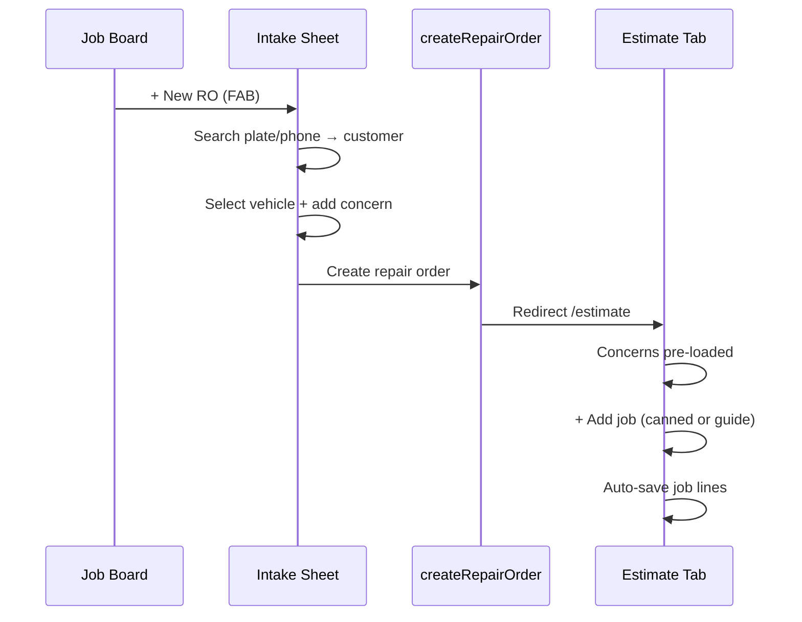

# Ultimate order process — intake through first estimate

**Version:** 1.0 (Order Process Lab)  
**Date:** 2026-07-05  
**Status:** Design spec — isolated test; not merged to production  
**Sources:** SnagIt library (see `SNAGIT-LIBRARY.md`), Batch 5 intake, Estimate Building lab, competitive research

---

## Executive summary

The fastest user-friendly order flow for ShopRally advisors combines:

1. **AutoLeap speed** — open intake from Job Board FAB without leaving context; search-first identity; RO lands on Estimate immediately.
2. **Tekmetric completeness** — concerns, odometer, lead source, and guardrails captured **before** estimate building; duplicate/active-RO warnings as choices.
3. **Inline estimate building** — first job added via toolbar/launcher; edit in place with auto-save (no per-job pencil mode).

**North-star metric:** Experienced advisor creates RO with one concern and **one quoted job** in **≤ 3 minutes**.

---

## Personas

| Persona | Goal | Success |
|---------|------|---------|
| **Service advisor** | Turn walk-in/phone into a quotable RO fast | ≤ 3 min to first job line |
| **Shop owner** | Consistent data (odometer, source, concerns) | Required fields enforced softly |
| **Customer (implicit)** | Accurate quote, no re-asking vehicle info | Plate/VIN resolves identity once |

---

## End-to-end flow (happy path)

```
Job Board
  → [+ New repair order] FAB / toolbar
  → Intake sheet (slide-over, sidebar stays visible)
      1. Customer search (plate/phone/name) → select
      2. Vehicle (fleet card OR plate lookup)
      3. Visit: concern chip + odometer + lead source
  → [Create repair order]  Alt+Enter
  → /repair-orders/{id}/estimate  (NOT summary tab)
      4. Services tab active
      5. Search jobs & templates OR + Add job → Labor Guide
      6. Inline edit labor/qty; auto-save
      7. Sticky bar shows total + GP; advisor ready to send/print
```

### Mermaid (sequence)



---

## Phase 1 — Entry (≤ 5 seconds)

| Step | Action | UI | Best practice |
|------|--------|-----|---------------|
| 1.1 | Advisor on Job Board | `/job-board` | Default landing for writers (Tekmetric pattern) |
| 1.2 | Click **+ New repair order** | FAB bottom-right OR toolbar | AutoLeap instant entry; no full-page navigation required |
| 1.3 | Sheet opens | Slide-over, ~480–560px | Sidebar stays — user preference from intake research |

**Alternate entries (same form):**

- Customer detail → **New repair order** (customer pre-filled)
- `/repair-orders/new` full page (deep link / bookmark)

**Do not:** Force focus mode that hides sidebar during intake.

---

## Phase 2 — Customer identity (≤ 15 seconds)

| Step | Action | UI | Best practice |
|------|--------|-----|---------------|
| 2.1 | Search mode pills | Name · Phone · Plate · VIN | AutoLeap — matches how advisors think |
| 2.2 | Type query | Single search field | One field, not four separate inputs |
| 2.3 | Select result | Click row OR **Enter** on first hit | Keyboard-first (both videos) |
| 2.4 | No match | **+ Add customer** modal | Tekmetric Person/Business; comm prefs collapsed |

**Streamline rules:**

- Plate search that resolves **customer + vehicle** skips Phase 3 fleet pick (jump to 3.2 confirm).
- Selected customer shows compact chip with **×** clear — one click to reset.
- Progress pill **Customer ●** turns complete on selection.

---

## Phase 3 — Vehicle (≤ 15 seconds)

| Step | Action | UI | Best practice |
|------|--------|-----|---------------|
| 3.1 | Existing fleet | Vehicle cards for customer | Tekmetric — one click select |
| 3.2 | Plate/VIN path | Lookup field + state + Lookup btn | Both competitors |
| 3.3 | New vehicle | **+ Add vehicle** modal | Tabs: Lookup · Fleet · Manual |
| 3.4 | Duplicate VIN | **Transfer vehicle** dialog | Preserve history (both products) |
| 3.5 | Active RO warning | Table of open ROs — Open existing / Continue new | Tekmetric guardrail |

**Streamline rules:**

- Auto-select when customer has **one** vehicle and plate search matched.
- Progress pill **Vehicle ●** on selection.
- Do not block Create on warnings — require explicit choice.

---

## Phase 4 — Visit details (≤ 15 seconds)

| Step | Action | UI | Best practice |
|------|--------|-----|---------------|
| 4.1 | Customer concern | Textarea + Add → **chips** | Tekmetric — on intake, not post-create Concerns tab hop |
| 4.2 | Odometer | Numeric + **Odometer N/A** checkbox | Shop compliance |
| 4.3 | Visit type | Drop-off / Wait / etc. | Operational |
| 4.4 | Labor rate | Shop rate selector | Matrix entry point |
| 4.5 | Lead source | Dropdown (if shop requires) | Marketing attribution |

**Streamline rules:**

- **Minimum viable create:** customer + vehicle + **≥1 concern chip** (configurable shop setting).
- Primary CTA: **Create repair order** — not "Save draft" + separate "Open estimate".
- Keyboard: **Alt+Enter** submits from any field in form.
- Cancel returns to Job Board without orphan draft (unless draft RO# feature ships).

---

## Phase 5 — Handoff to estimate (≤ 5 seconds)

| Step | Action | Expected |
|------|--------|----------|
| 5.1 | Server creates RO | `status: ESTIMATE`, concerns → `vehicleConcerns` |
| 5.2 | Client redirect | `/repair-orders/{id}/estimate` |
| 5.3 | Lifecycle strip | Shows **Quoted** phase |
| 5.4 | Concerns tab | Intake chips visible as Smart Jobs / concerns |
| 5.5 | Default tab | **Services** (work lines) focused for building |

**Do not:**

- Land on RO Summary tab first (extra click).
- Require "Convert to estimate" step (AutoLeap anti-pattern when identity incomplete).
- Show empty Services grid **during** intake (keep line items estimate-phase only).

---

## Phase 6 — First estimate job (≤ 90 seconds)

| Step | Action | UI | Best practice |
|------|--------|-----|---------------|
| 6.1 | Services toolbar | Search jobs & templates · **+ Add job** | AutoLeap toolbar + Tekmetric launcher |
| 6.2 | Add via template | Pick canned job → inserts job card | Fastest path for common work |
| 6.3 | Add via labor guide | Launcher → Smart Labor Guide → matrix rate | Tekmetric depth |
| 6.4 | Edit job | Inline name, labor hours, parts qty | AutoLeap — no pencil gate |
| 6.5 | Save feedback | Unsaved → Saving → Saved (debounced ~1.2s) | Single RO-level save semantics |
| 6.6 | Job menu **⋮** | Add labor, part, fee, discount, delete | Without leaving card |
| 6.7 | Sticky footer | Labor, parts, tax, total, GP $/% , Get approval | Always visible on Services tab |

**Dedup (right rail vs main column):**

| Show once | Location |
|-----------|----------|
| Customer / vehicle / RO # | Context header |
| Odometer | Odometer hero bar |
| Estimate totals + GP | Sticky bar (primary) |
| Auth counts + profitability | Right rail (secondary detail) |
| Per-job auth + lines | Job cards |

Right rail **below profitability:** workflow chips, promised time, outreach status (future — see research doc).

---

## Keyboard shortcuts

| Key | Context | Action |
|-----|---------|--------|
| **Enter** | Customer search results focused | Select first result |
| **Alt+Enter** | Intake form | Create repair order |
| **Escape** | Intake sheet | Close (confirm if dirty) |
| **/** | Estimate Services tab | Focus job search (future) |

---

## Error & edge cases

| Case | Behavior |
|------|----------|
| Required odometer (shop setting) | Inline validation on Create — scroll to field |
| Required lead source | Same |
| Duplicate active RO | Warning modal — default highlight "Open existing" |
| VIN on another customer | Transfer recommended — allow override with audit note |
| Network fail on create | Toast + retry; do not close sheet |
| Empty concern (strict shop) | Block Create with pill highlight on Visit section |

---

## Production mapping (reference — do not edit in lab)

| Spec area | Production file(s) |
|-----------|-------------------|
| FAB + sheet | `create-ro-fab.tsx`, `ro-intake-sheet.tsx`, `ro-intake-context.tsx` |
| Intake form | `ro-intake-form.tsx` |
| Create action | `server/actions/repair-orders.ts` → `createRepairOrder` |
| Default open | `lib/ro-workspace.ts` → `defaultRoOpenHref` |
| Estimate UI | `estimate/page.tsx` → `EstimateBuildingLabPanel` |
| Job inline edit | `estimate-job-card.tsx`, `estimate-lab-*` |

---

## Future streamlining (backlog — not blocking v1 test)

| Item | Source | Impact |
|------|--------|--------|
| Draft RO# on sheet open | AutoLeap `2BBF85F0` | Psychological progress |
| Plate search → skip vehicle step | Both videos | −1 click |
| Forms Hub → pre-filled intake | Gap strategy #2 | −30s for web leads |
| Unsaved tab guard on estimate header | Estimate blend backlog | Prevents data loss |
| Right rail workflow chip | FA2ED0E7 video | At-a-glance status |

---

## Acceptance criteria (for Agent 2)

- [ ] T1–T8 in `TEST-SCRIPT.md` pass on localhost:3004
- [ ] Happy path ≤ 3 minutes
- [ ] No competitor strings visible in UI
- [ ] Concerns from intake appear on estimate without manual re-entry
- [ ] First job editable inline without entering edit mode

---

## Approval gate

| Stage | Owner action |
|-------|--------------|
| Lab spec approved | User signs off on this doc |
| Test pass | Agent 2 `TEST-RESULTS.md` all green |
| Video review | Agent 3 walkthrough watched |
| Production merge | Separate PR — ShopRallyCRM agent, not Order Process Lab |
