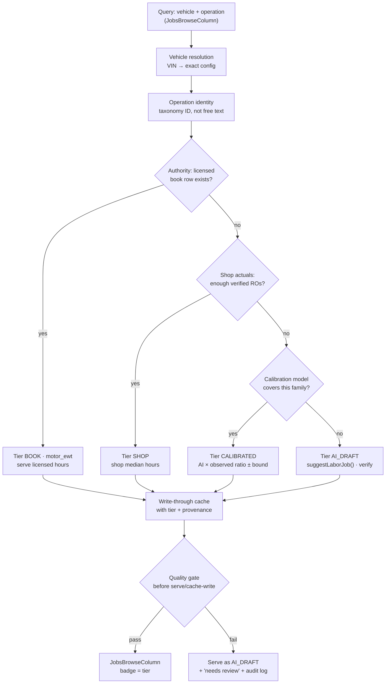

# Labor Estimate Algorithm — from "guessing game" to grounded times

**Date:** 2026-07-09
**Workspace:** ShopRally (`C:\Users\tabis\OneDrive\Documents\ClaudeCode\ShopRally`) · Dev :3031
**Status:** Design plan + **partially implemented** — building the **no-MOTOR path** (user cannot license MOTOR/Mitchell). **T0 honesty labels + T1-lite shop-history authority are now IMPLEMENTED** (see §4.1). NO new floors added; MOTOR licensed mode stays OFF.
**Author context:** Written in response to the "AI ESTIMATE times are night-and-day vs ProDemand/Tekmetric/AutoLeap" problem on `JobsBrowseColumn`.
**Related:** `docs/design/ai-labor-guide-datasets-and-competitors.md`, `docs/design/motor-taxonomy-ai-labor-integration.md`, `docs/design/labor-book-prodemand-tekmetric.md`, `agents/ShopRallyCRM/BUILD-STATE.md`

---

## 4.1 IMPLEMENTATION STATUS — no-MOTOR path (2026-07-09)

Because MOTOR/Mitchell licensing is not affordable, we shipped the license-free tiers of this plan:

**T0 — Honesty labels (DONE).**
- `laborTierFromDataSource(dataSource, source)` in `src/lib/labor-guide-helpers.ts` is the single source of truth mapping provenance → tier: `motor_ewt`→**BOOK**, `shop_history`/canned→**SHOP**, all `ai_*`/legacy→**AI-DRAFT · verify** (billable=false, verify=true). `sourceBadgeLabel` / `sourceBadgeClass` / `dataSourceBadgeLabel` all delegate to it, so every surface (JobsBrowseColumn rows + detail header + cart, grid rows, companions, quick-labor) stops saying "AI estimate" and shows the tier.
- `smart-labor-guide.tsx`: AI rows always carry the "verify" label; browse header shows a visible **"AI drafts — verify before quoting"** disclosure in unlicensed mode (MOTOR note in licensed); confidence is surfaced on AI/verify rows.
- Confidence no longer flattened to `0.5` on cache reads (`cachedRowToHit` carries the stored score through).
- Provenance preserved into the cart/job: `LaborCartLine.dataSource` + `ResolvedLaborCompanion.dataSource` thread through `variantToCartLine` / `suggestionToCartLines` / `hitToCartLines` / companion add.

**T1-lite — Shop-history authority (DONE, no floors).**
- `src/server/services/shop-history-labor.ts` (`resolveShopHistoryLabor`) mines `LaborLine.hours` for the same shop + vehicle family (YMM, falling back to make/model) + same operation subcategory (+ axle position when named); returns the **median** when **n ≥ 3** (`SHOP_HISTORY_MIN_SAMPLES`), labeled `dataSource = shop_history` (tier SHOP) with sample-scaled confidence (never a flat 0.5). **No floors/ceilings** are applied on this path.
- Wired into `lookupLaborSuggestion` (`labor-guide-cache.ts`) **above `ai_first_principles`** and **below licensed MOTOR**: on a fresh grounded (MOTOR/shop_history/curated) cache row it is skipped; otherwise it is resolved and **preferred over a cached AI draft**, then written through as a `shop_history` cache row. `shopId` flows via `LaborLookupOptions.shopId` from `generateLaborSuggestion` / `generateQuickLabor`.
- Floors (`labor-hours-calibration.ts`) are **untouched and not expanded** — they remain only as a transitional net behind the AI-DRAFT label, never on BOOK/SHOP.

**Resolver order now:** exact grounded cache → licensed MOTOR (off) → **shop history (n≥3)** → AI first-principles (AI-DRAFT).

**Still deferred:** gold set / eval harness (T2), `LaborCalibration` ratios to replace floors (T2), concurrent + additional-labor tables (T3), clock/wrench time (`TimeLog` model), and enabling licensed MOTOR (T1).

---

## 0. TL;DR (read this first)

1. **The current path feels like guessing because it *is* an educated guess.** We prompt an LLM to invent flat-rate hours "from first principles," then bolt on hardcoded minimum-hour floors (`labor-hours-calibration.ts`) to stop the worst undershoots. An LLM has no book; floors are arbitrary. Both are guessing with extra steps.

2. **You cannot get Tekmetric/AutoLeap/ProDemand accuracy from AI alone. Full stop.** Those products are accurate because they license **MOTOR Estimated Work Times (EWT)** and/or **Mitchell ProDemand** — commercial databases built from decades of OEM procedures and physical teardown time studies. There is **no open dataset** and **no prompt** that reproduces those numbers. AI can classify, match, normalize, and gap-fill — it cannot *invent* a real book time.

3. **The good news:** MOTOR is already fully wired in this codebase (`src/server/services/motor/*`, `motor_ewt` dataSource, `MotorCatalogApplication` cache). It is currently **switched off** (`MOTOR_SANDBOX_CACHE` opt-in, no production license). The single highest-leverage move for accuracy is **licensing MOTOR DaaS and turning it on as the source of truth.**

4. **Immediate, zero-license win (this week):** stop *presenting a guess as if it were a book*. Replace the single "AI ESTIMATE" badge with **honest confidence tiers** (`BOOK` / `CALIBRATED` / `AI DRAFT — verify`). This directly fixes the trust problem in the screenshot without pretending we have data we don't.

5. **Floors/ceilings are rejected as strategy** — and this doc agrees. Floors are a symptom-suppressor. The real fix is a **layered resolver with an authority source**, honest labeling, and (once we have observations) **calibration from real data, not arbitrary minimums.**

---

## 1. Why the current path feels like guessing (root causes)

### 1.1 The pipeline today

```
JobsBrowseColumn (smart-labor-guide.tsx)
   → lookupLaborSuggestion()            [labor-guide-cache.ts]
      → LaborOperation cache hit? serve
      → miss → resolveLaborSuggestionWithFallback()  [labor-guide-resolver.ts]
         → suggestLaborJob()            [labor-guide.ts]  ← Claude, first-principles prompt
         → applyLaborHoursFloor()       [labor-hours-calibration.ts]  ← hardcoded minimums
      → write-through to LaborOperation, dataSource = "ai_first_principles"
   → badge: sourceBadgeLabel() → "AI estimate" (rendered uppercase = "AI ESTIMATE")
```

### 1.2 Root causes

| # | Root cause | Evidence in code | Effect |
|---|-----------|------------------|--------|
| R1 | **No authority source is active.** MOTOR is coded but disconnected. The default `reference` mode never reaches licensed hours. | `labor-catalog-mode.ts` → `isReferenceTaxonomyMode()` default true; `allowSandboxMotorDbCache()` default false | Every number ultimately traces to the LLM. |
| R2 | **LLM invents hours with no book.** The prompt explicitly says *"Do not reference proprietary guide books"* and *"Use first-principles reasoning."* | `labor-guide-prompt.ts` `HOURS_CALIBRATION_BLOCK` | High variance job-to-job and vs industry; "night and day" on the same car. |
| R3 | **Floors mask, don't fix.** `LABOR_HOURS_FLOORS` are hand-typed minimums per family; the model even gets a "you're below our floor, try again" retry. | `labor-guide.ts` `correctionPrompt()`, `labor-hours-calibration.ts` | Numbers get dragged toward an arbitrary constant, not toward a real vehicle-specific time. Explains why "Brake Pads R&R Front" looks off — it's a floor, not a book row. |
| R4 | **The cache launders provenance.** A first-principles guess is written to `LaborOperation` and re-served for 180 days as a stable-looking row; siblings inherit it via VIN→YMM promotion. | `labor-guide-cache.ts` `promoteVinCacheToYmm`, `TTL_DAYS=180` | A one-time guess becomes "the catalog." Confidence gets flattened to `0.5`. |
| R5 | **UI presents a guess as an authority.** One badge ("AI estimate") for everything; low-confidence warning only fires under `< 0.6`, but cache reads hardcode `0.5`, so warnings rarely show. | `smart-labor-guide.tsx` L513–532, `cachedRowToHit` `confidenceScore ?? 0.5` | The advisor sees "AI ESTIMATE · 0.80 hrs" and reasonably assumes it's book-grade. It isn't. |
| R6 | **No vehicle-specificity in the number.** Prompt gets YMM + engine + maybe VIN text, but the model can't differentiate a RWD vs AWD access difference the way a real config-filtered book row does. | `buildVehiclePrompt()` | Same job, different platforms → similar guess; real books diverge. |

**Bottom line:** the system is *architected correctly for swapping in real data* (clean `dataSource` provenance, cache write-through, resolver ladder) but is currently *running on the fallback layer as if it were the primary*, and the UI doesn't say so.

---

## 2. What "real data" actually means (options for ShopRally)

There is no way around this table. This is the honest landscape.

### 2.1 Licensed labor catalogs — the only path to Tekmetric-class accuracy

| Source | What it gives | Status in ShopRally | Cost/commitment | Recommendation |
|--------|---------------|---------------------|-----------------|----------------|
| **MOTOR DaaS — Estimated Work Times** | Vehicle-config-specific R&R book times, taxonomy (System→Group→SubGroup→LiteralName), positions/qualifiers, ACES `BaseVehicleID` | **Already integrated in code**; sandbox synced (846 apps for one Civic); production license **not** held; currently disabled | Commercial DaaS subscription + agreement | **Primary source of truth. License it.** Lowest integration cost because the code exists. |
| **Mitchell ProDemand** | Independent labor times (often 10–30% higher), parts, procedures, TSBs | Not integrated | Shop subscription + Mitchell partner agreement | Optional **tier-2 punch-out** later (Tekmetric "Grow" parity). Do not merge IDs with MOTOR. |
| **ALLDATA** | OEM-published labor times | Not integrated | Per-shop subscription | Optional punch-out; low priority. |
| **Identifix Direct-Hit** | Bundled MOTOR/Mitchell + confirmed fixes | Not integrated | Subscription | Diagnostic bundle, not a primary hours source. |

### 2.2 Real data you already own (weaker, but legitimately "real observations")

| Source | What it gives | Status | Honest limitation |
|--------|---------------|--------|-------------------|
| **Shop RO labor actuals** — `LaborLine.hours` per `Job`, with `technicianId` | Hours the shop actually *billed* for a job on a real vehicle | Present in schema (`LaborLine`, `Job`) | These are **advisor-entered billed hours**, not clocked wrench time (no `TimeLog`/clock model exists yet). Still: real, shop-specific, and a valid calibration signal once volume exists. |
| **`LaborOperation` hit counts** | Which operations get searched/used most | Present | Popularity signal for what to prioritize licensing/curating, not a time source. |
| **Curated "gold set"** | Hand-verified times for the top ~200 jobs on the top ~50 platforms, sourced from a licensed book or a shop master tech | Does not exist yet | Cheap to start, high trust, bounded scope. Excellent T1 bridge and an eval harness forever. |

### 2.3 Vehicle identity data (already fine)

NHTSA vPIC (VIN decode) and VCdb/ACES concepts are used for vehicle resolution only. They contain **no labor hours** and never will. Keep them for identity; do not expect times from them.

### 2.4 What to NOT do (legal + quality)

- Do **not** scrape "free labor time" APIs (Open Labor Project, cost-aggregators) into `LaborOperation` — unknown provenance, derivative-copyright risk, not book-grade.
- Do **not** fine-tune or bulk-prompt an LLM on MOTOR/Mitchell text — prohibited without a generative license.
- Do **not** let AI silently overwrite a licensed hour.

---

## 3. Recommended architecture — layered resolver with an authority source

The design keeps the existing clean structure and makes three changes: (a) an **explicit authority tier**, (b) **honest confidence tiers surfaced to the UI**, and (c) **calibration from observations, not arbitrary floors**.

### 3.1 Confidence tiers (the core concept)

Every served time carries a **tier** that maps 1:1 to a UI badge and to whether it is billable-without-review:

| Tier | Meaning | Source | UI badge | Billable as-is? |
|------|---------|--------|----------|-----------------|
| `BOOK` | Licensed vehicle-specific book time | MOTOR EWT (or Mitchell/ALLDATA later) | **BOOK** (blue) | Yes |
| `SHOP` | This shop's own verified/repeated actuals | Shop RO history above a volume+variance threshold | **SHOP TIME** (green) | Yes (shop's own data) |
| `CALIBRATED` | AI draft adjusted by a real observed ratio (gold set or shop history) with known error bounds | AI + calibration model | **CALIBRATED** (amber) | With glance |
| `AI_DRAFT` | Pure model estimate, no grounding | `suggestLaborJob` | **AI DRAFT — verify** (red) | **No** — review required |

This replaces the current single "AI ESTIMATE" badge. It is the honesty fix and it is the gatekeeping mechanism.

### 3.2 Resolver precedence



Note this is the *same ladder the code already has* (`resolveLaborSuggestionWithFallback`), with the authority tier promoted to the top and the output **tier-labeled** instead of floor-adjusted.

### 3.3 Where AI is allowed vs forbidden

| AI is ALLOWED to… | AI is FORBIDDEN from… |
|-------------------|------------------------|
| Classify a free-text query → taxonomy operation ID | Being the **sole authority for billed hours** presented as book-grade |
| Extract/normalize operation steps for display | Silently overwriting a `BOOK` or `SHOP` time |
| Suggest companion/additional operations (pads→rotors, tie-rod→alignment) | Inventing a number and having it re-served for 180 days at flat 0.5 confidence with no "verify" label |
| Produce an explicit `AI_DRAFT` when no grounded source exists | Being labeled anything other than `AI_DRAFT` when ungrounded |
| Learn a calibration ratio *from real observations* | Hitting an arbitrary hand-typed floor and calling it calibration |

### 3.4 Calibration WITHOUT floors (how we replace `labor-hours-calibration.ts`)

Floors say "brake pads can never be < 1.0 hr" — an arbitrary constant. Calibration says "on the jobs where we have a real book/shop time, the raw AI estimate is systematically X% low for this operation family; apply that observed correction and report the residual error."

- Build a **calibration table** keyed by operation family (and later platform class) from the **gold set** and **shop actuals**: `ratio = observed_time / raw_ai_time`, plus a variance/error band.
- At serve time for an ungrounded job, `CALIBRATED_hours = raw_ai × family_ratio`, tier = `CALIBRATED`, and the UI shows the error band ("±0.3 hr").
- If a family has no observations, there is **no calibration** — it stays honest `AI_DRAFT`. No floor invented.
- This is defensible ("grounded in real data") and self-improving; floors are neither.

Floors can remain **only** as a transitional safety net behind an `AI_DRAFT` label until the gold set + calibration exists, then be deleted. They are never presented as book-grade.

---

## 4. Phased implementation plan

### T0 — Honesty labels (no license, ~1–2 days) — **DO THIS FIRST**

Goal: stop presenting a guess as a book. This is the direct fix for the screenshot.

- Introduce a `tier` concept derived from `dataSource` (map `ai_first_principles` → `AI_DRAFT`, `motor_ewt` → `BOOK`, etc.). Central helper next to `dataSourceBadgeLabel()` in `labor-guide-helpers.ts`.
- `JobsBrowseColumn` (`smart-labor-guide.tsx` L508–517): replace the single badge with the tier badge; for `AI_DRAFT`, always show "verify" affordance regardless of the flattened 0.5 confidence.
- Stop hardcoding `confidenceScore ?? 0.5` on cache reads (`cachedRowToHit`) — persist and surface the model's real confidence so the `< 0.6` warning works.
- Add a one-line disclosure in the browse panel header for ungrounded shops: "Hours are AI drafts — verify before quoting" (uses existing `laborCatalogDisplayLabels`).
- **Outcome:** advisors immediately see which numbers are trustworthy. No accuracy change, but the trust problem is honestly framed. Cheap, reversible, high value.

### T1 — Authority source: license + enable MOTOR (biggest accuracy jump)

Goal: real vehicle-specific book times for covered jobs.

- Obtain **MOTOR DaaS production license** (business action — see §5).
- Flip `LABOR_CATALOG_MODE=licensed` + MOTOR keys; the code path already exists (`isLicensedMotorCatalog()`, `findMotorCatalogApplicationMatch`, `motor_ewt`).
- Backfill top fleet vehicles via the existing sync scripts / an Inngest batch (`M2b` fleet sync in the datasets doc).
- Served MOTOR rows → tier `BOOK`. AI now only fires on genuine catalog gaps, labeled `AI_DRAFT`.
- **Parallel, no-license bridge:** hand-build a **gold set** (top ~200 ops × top ~50 platforms) as a curated `dataSource` (`shop_curated`/`gold`) so even unlicensed shops get some `BOOK`-equivalent trusted rows and we get an eval harness.
- **Outcome:** most common jobs become genuinely accurate; the rest are honestly flagged.

### T2 — Calibration from observations (replace floors)

Goal: make the *remaining* AI drafts measurably better, grounded in real data.

- Build the eval harness: for every gold-set/MOTOR row, record `raw_ai` vs `observed` → per-family ratio + error band. This is the "gold set" the user asked for.
- Add a `LaborCalibration` table (family → ratio, sample size, error band, last updated).
- Ingest **shop RO actuals** (`LaborLine.hours` aggregated per operation+platform) once a shop has volume; promote to tier `SHOP` above a variance/count threshold.
- Delete `labor-hours-calibration.ts` floors once families are covered; where uncovered, stay `AI_DRAFT`.
- **Outcome:** "grounded in real data, no floors." Self-improving as usage grows.

### T3 — Concurrent / additional-labor tables + config tiers

Goal: Tekmetric-parity depth.

- Use MOTOR concurrent/overlap + additional-labor data (or curated ratios) so "front + rear" and companion jobs overlap correctly instead of naive multiplication.
- Skill/condition tiers (standard vs rust/AWD/seized) as real qualifiers, not a single number.
- Feed the existing `labor-companion-graph.ts` from licensed/observed data instead of static ratios.
- **Outcome:** multi-op estimates match the book, not `hours × units`.

---

## 5. Effort & resources

| Phase | Eng effort | External dependency | Risk if skipped |
|-------|-----------|---------------------|-----------------|
| T0 honesty labels | ~1–2 dev-days | none | Advisors keep trusting guesses → **CRM survival risk** (user's own framing) |
| T1 MOTOR license + enable | ~3–5 dev-days once licensed | **MOTOR DaaS contract (cost + legal)**; MOTOR is the gating resource | No path to Tekmetric-class accuracy |
| T1 gold set (parallel) | ~3–5 days curation + tooling | a licensed book or master tech to source times | Unlicensed shops stay all-`AI_DRAFT` |
| T2 calibration + eval | ~1–2 weeks | shop RO volume for `SHOP` tier | "No floors" promise unmet; can't prove accuracy |
| T3 concurrent tables | ~2–3 weeks | MOTOR concurrent data or curation | Multi-op estimates stay approximate |

**The one resource that matters most: a MOTOR DaaS production license.** Everything else is engineering we can do; book-grade *hours* are a purchased product. Be clear-eyed: AI alone will never equal ProDemand.

---

## 6. Immediate next build step

**Ship T0 honesty labels on `JobsBrowseColumn`.** Concretely:

1. Add a `laborTierFromDataSource(dataSource, source)` helper in `labor-guide-helpers.ts` returning `{ tier, label, className, billable }` for `BOOK | SHOP | CALIBRATED | AI_DRAFT`.
2. In `smart-labor-guide.tsx` (`JobsBrowseColumn` row, ~L508–540 and detail header ~L664), render the tier badge and, for `AI_DRAFT`, an always-on "AI draft — verify hours" chip.
3. Stop overwriting real confidence with `0.5` in `cachedRowToHit`/`toSuggestion`; carry through the stored `confidenceScore`.
4. Add the panel-header disclosure string via `laborCatalogDisplayLabels`.

This is reversible, needs no license, and directly resolves the "AI ESTIMATE presented as book" honesty problem in the screenshot — while T1 (MOTOR license) is pursued as the real accuracy fix.

---

## 7. Screenshot context — the honesty problem

In the referenced UI (`JobsBrowseColumn`: "Brake Pads R&R — Front", breadcrumb *Front Brakes › Disc Brakes › Brake Pads*, operation steps listed, badge **"AI ESTIMATE"**):

- The layout, breadcrumb, and steps are good — they look exactly like a licensed labor guide.
- **That is precisely the problem.** A first-principles LLM guess (possibly nudged by an arbitrary floor) is dressed in the visual language of a book row. The advisor cannot tell "0.80 hrs" is a guess, not a MOTOR time. That mismatch is what makes it feel like a guessing game *and* erodes trust when the number is off vs ProDemand.
- T0 fixes the framing (badge = `AI DRAFT — verify`); T1 fixes the substance (badge = `BOOK` from licensed MOTOR). Do both, in that order of speed.

---

## 8. Honest conclusion

- The current numbers are **educated guesses with cosmetic floors**, presented as authoritative. That is the root of the "night and day vs industry" complaint.
- **No prompt, model, or open dataset will produce ProDemand/MOTOR times.** Those are licensed, teardown-derived commercial products. AI's honest role here is classification, matching, companions, and *calibrated* gap-fill — not authorship of billed hours.
- The codebase is already built to swap in real data cleanly (MOTOR wired, `dataSource` provenance, resolver ladder). The blockers are a **business decision (license MOTOR)** and a **product-honesty decision (tier labels)** — not architecture.
- Recommended order: **T0 honesty now → T1 MOTOR license + gold set → T2 calibration (delete floors) → T3 concurrent depth.**

---

## 9. Competitive intel — AutoLeap Magic & source-tab honesty

AutoLeap's public labor estimating story is still **MOTOR + Mitchell1 book time**, not generative AI hours. Public "Magic" features are AI assists — Magic Parts Lookup, descriptions, technician notes, AIR — not a book-time authority.

Frame-verified SnagIt evidence supports that separation: the browse modal labels source tabs as **AutoLeap / MOTOR Primary / MOTOR Secondary / Magic Services**. AI is a visible lane, never dressed as the book.

ShopRally should piggyback the pattern, not the data: dual **BOOK** vs **AI** lanes, per-row provenance, confidence UX, and MOTOR-first / AI-on-miss resolution. We cannot piggyback AutoLeap's models, their MOTOR/Mitchell license, or scraping.

The code already has `dataSource` provenance (`motor_ewt`, `ai_*`), but `JobsBrowseColumn` collapses it. T0 should surface AutoLeap-style labeled sections plus **"AI estimate · verify"**, aligned with the honesty tiers above.
