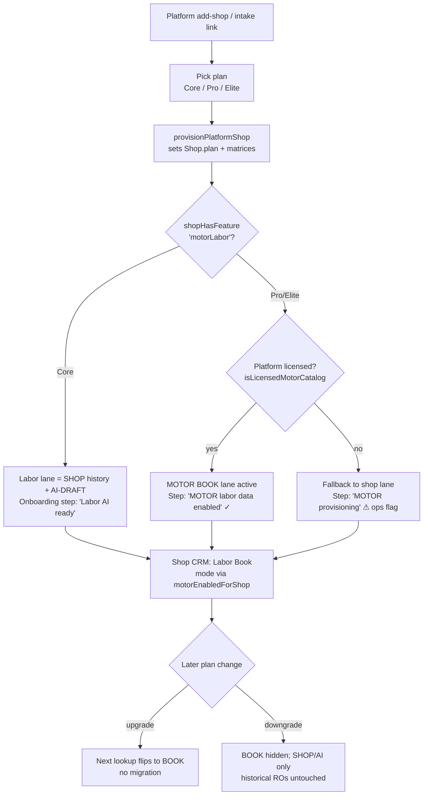

# Plan — Tier-gated MOTOR labor data (plan management + onboarding)

**Date:** 2026-07-09
**Workspace:** ShopRally (`C:\Users\tabis\OneDrive\Documents\ClaudeCode\ShopRally`) · Dev :3031
**Status:** PLANNING deliverable. No MOTOR licensing/billing implemented here. No deploy.
**Related:** `agents/ShopRallyCRM/LABOR-ESTIMATE-ALGORITHM.md` (no-MOTOR path already shipped — T0 honesty + T1-lite shop history), `src/lib/plans.ts`, `src/lib/subscription.ts`, `src/lib/labor-catalog-mode.ts`, `src/server/labor-guide-cache.ts`

---

## 1. Executive summary

ShopRally will license **MOTOR DaaS Estimated Work Times (EWT)** and offer licensed flat-rate labor
data **only on the upper tiers (Pro / Elite)**. **Core (Starter)** keeps the already-shipped
license-free lane: **shop RO history (tier SHOP) + AI-DRAFT (verify)**. This is both a cost decision
(MOTOR is the platform's most expensive COGS; Mitchell is unaffordable) and an honesty decision — we
must not present a MOTOR-grade "BOOK" badge to a Core shop that has no licensed data behind it.

The **single biggest architectural change** is that today the labor catalog mode is resolved
**process-wide from env** (`getLaborCatalogMode()` / `isLicensedMotorCatalog()` read only
`process.env`). To sell MOTOR per tier we must add a **second, per-shop entitlement layer** so the
effective mode is:

```
motorEnabledForShop(shop) = isLicensedMotorCatalog()        // platform holds the license + keys
                            && shopHasFeature(shop,'motorLabor')  // this shop's plan bought it
```

The marketing copy already promises this split (`LABOR_PLAN_COPY`: "Labor AI on Core · licensed data
+ Labor AI on Pro+"), but **no `motorLabor` feature key or gate exists yet** — `laborGuide` is
currently `true` on every tier and the resolver never checks the shop. This plan closes that gap:
define the feature key, layer the resolver gate, provision the feature at onboarding, and make the
Labor Book / Settings UI adjust to the shop's plan.

**Recommended ops model:** one **platform-wide MOTOR DaaS license + one credential set**, served to
many tenants (standard DaaS reseller model). MOTOR book/taxonomy rows are non-PII reference data and
are safely shared across tenants in the existing `MotorCatalogApplication` / `LaborOperation`
(`motor_ewt`) cache — so there is **no per-shop MOTOR data to copy, migrate, or delete** on
upgrade/downgrade. Entitlement is purely a serve-time gate.

---

## 2. Current state (verified in code)

| Area | File | Reality today |
|------|------|---------------|
| Tiers | `src/lib/plans.ts` | `STARTER`=Core, `PROFESSIONAL`=Pro, `ENTERPRISE`=Elite. `PlanFeature` union + `PlanFeatureSet` per tier. `laborGuide: true` on **all three**. No labor-source feature key. |
| Labor marketing copy | `plans.ts` `LABOR_PLAN_COPY`, `PLATFORM_MODULES` (Labor Book) | Already says Core = "Labor AI", Pro+ = "Licensed data + Labor AI". Promise exists; **gate does not.** |
| Feature gate | `plans.ts` `shopHasFeature()`, `subscription.ts` `canUseFeature()` + `FEATURE_MAP` | Solid pattern (PartsTech, SMS, campaigns, AI features all gated this way). `laborGuide` → `laborGuide` (true everywhere). |
| Catalog mode | `src/lib/labor-catalog-mode.ts` | `getLaborCatalogMode()`, `isLicensedMotorCatalog()`, `isReferenceTaxonomyMode()`, `allowSandboxMotorDbCache()` — **env only, no shop dimension.** |
| Resolver | `src/server/labor-guide-cache.ts` `lookupLaborSuggestion(vehicle, request, {shopId,...})` | Already receives `options.shopId` (used for shop-history). MOTOR gates use `isLicensedMotorCatalog()` (env). Order: exact grounded cache → licensed MOTOR (off) → shop history (n≥3) → AI first-principles. |
| Labor Book UI feed | `src/server/actions/labor-book-motor.ts` | `getLaborBookMotorInit` / `getLaborBookMotorApplications` branch on `isReferenceTaxonomyMode()` (env). Returns `source: "motor" | "reference" | "shop"` + `catalogMode`. |
| Tier badges | `src/lib/labor-guide-helpers.ts` `laborTierFromDataSource()` | Already maps provenance → `BOOK / SHOP / CALIBRATED / AI_DRAFT`. `motor_ewt`/`y_mm_catalog`/catalog → BOOK. **This is the honesty gate and it is done.** |
| Provisioning | `src/server/platform/provision-shop.ts` | Creates shop with `plan`, default part/labor matrices. **No labor-catalog or feature provisioning.** |
| Onboarding checklist | `src/server/platform/onboarding.ts` | Compliance + operational steps (approve, provision, billing, connect, team, sms, golive). **No labor/MOTOR step; nothing plan-conditional.** |
| Plan picker | `src/lib/platform-shop-form.ts` (`plan: z.nativeEnum(ShopPlan)`), platform add-shop + `/onboard/shop/[token]` intake | Platform admin sets plan at add-shop. Intake form defaults exist. |
| Subscription settings | `src/app/(app)/settings/subscription/page.tsx` → `BillingModule` | Read-only billing overview. No labor/MOTOR connection surface. |

**Key gaps to close:** (1) no `motorLabor` feature key; (2) mode is process-wide, not per-shop;
(3) provisioning/onboarding don't set or reflect labor entitlement; (4) Labor Book/Settings don't
branch on the shop's plan (only on env).

---

## 3. Per-plan offering matrix (proposed)

Internal enums in parentheses; display names are Core / Pro / Elite.

| Dimension | **Core** (STARTER) | **Pro** (PROFESSIONAL) | **Elite** (ENTERPRISE) |
|-----------|--------------------|------------------------|------------------------|
| `motorLabor` feature key | **false** | **true** | **true** |
| Labor Book source | Shop history (tier SHOP, n≥3) → **AI-DRAFT · verify**. No MOTOR. | **MOTOR BOOK** → shop history → AI gap-fill (AI-DRAFT) | Same as Pro (+ future concurrent/additional-labor depth, T3) |
| Highest tier badge shown | `SHOP` (green) / `AI_DRAFT` (red) | `BOOK` (blue) + SHOP + AI_DRAFT | `BOOK` + SHOP + AI_DRAFT |
| Labor Book browse title | "Shop labor guide" (`laborCatalogDisplayLabels('reference')`) | "MOTOR Catalog" (`'licensed'`) | "MOTOR Catalog" |
| Browse header disclosure | "AI drafts — verify before quoting" | MOTOR provenance note | MOTOR provenance note |
| Settings → Labor page | Shows: markup matrices (Pro+ only, see note), shop labor rate, "Labor data: Labor AI + shop history". **No MOTOR connection card.** | Adds: "Labor data: MOTOR licensed (BOOK)" status card, MOTOR connection state (read-only, platform-managed), catalog coverage note | Same as Pro |
| `markupMatrices` (existing) | false | true | true |
| Onboarding: labor step | "Labor AI ready (no setup)" — auto-done | "MOTOR labor data enabled" step (auto-done when platform licensed; shows *provisioning* if platform license absent) | Same as Pro |
| Upgrade to this tier | n/a (entry) | MOTOR lane appears immediately (serve-time gate flips); no data migration | AI suite/maintenance also unlock |
| Downgrade from this tier | — | MOTOR lane hidden; new lookups return SHOP/AI only; **already-saved RO labor lines are untouched** | — |
| Plan set by | Platform admin at add-shop / intake (self-serve upgrade later, §7) | Platform admin, or self-serve upgrade | Platform admin / sales-assisted |

**Note on markup matrices:** `markupMatrices` is already `false` on Core / `true` on Pro+. MOTOR
gating aligns cleanly with that existing seam, so Core stays "estimate essentials" and Pro+ is the
"priced-book + matrices" experience.

**Honesty guardrail (non-negotiable):** a Core shop must **never** see a `BOOK` badge or "MOTOR
Catalog" wording. The tier system in `laborTierFromDataSource` already prevents mislabeling *given*
the data source; this plan ensures Core never *receives* a `motor_ewt` row in the first place.

---

## 4. Feature keys & the two-layer gate

### 4.1 New plan feature key

Add to `PlanFeature` union in `src/lib/plans.ts`:

```ts
export type PlanFeature =
  | ...existing...
  | "motorLabor";   // licensed MOTOR flat-rate BOOK times in the estimate
```

Per-tier values: `starterFeatures.motorLabor = false`, `professionalFeatures.motorLabor = true`,
`EliteFeatures.motorLabor = true`.

Add friendly key in `subscription.ts`:

```ts
export type SubscriptionFeature = ... | "motorLabor";
const FEATURE_MAP = { ..., motorLabor: "motorLabor" };
```

### 4.2 Two-layer effective gate (the core mechanism)

Platform license (env, one contract) **AND** shop entitlement (plan) must both be true:

```
Layer 1 — platform:  isLicensedMotorCatalog()        // LABOR_CATALOG_MODE=licensed + MOTOR_* keys
Layer 2 — shop:      shopHasFeature(shop,'motorLabor')  // Pro / Elite

effective:           motorEnabledForShop(shop) = Layer1 && Layer2
```

New server helper (proposed) `src/server/labor-entitlement.ts`:

```ts
// returns the per-shop catalog mode, layering plan entitlement over the platform license
export async function laborCatalogModeForShop(shopId: string): Promise<LaborCatalogMode>;
export async function motorEnabledForShop(shopId: string): Promise<boolean>;
```

This is the single seam every labor surface should call **instead of** raw
`isLicensedMotorCatalog()` / `isReferenceTaxonomyMode()`. The env functions stay as Layer-1 truth;
the new helper adds Layer 2.

### 4.3 Truth table

| Platform licensed (`isLicensedMotorCatalog`) | Shop plan `motorLabor` | Effective mode for shop | BOOK lane? |
|---|---|---|---|
| false (today's default) | any | `reference` | No — SHOP/AI only |
| true | false (Core) | `reference` | No — SHOP/AI only |
| true | true (Pro/Elite) | `licensed` | **Yes — MOTOR BOOK** |

Result: turning on the platform MOTOR license does **not** leak BOOK to Core shops, and Core keeps
working exactly as it does today.

---

## 5. UI / settings adjustments by plan

Every item below branches on `motorEnabledForShop(shopId)` (server) or a `motorLabor` boolean
passed to client components — **never** on raw env.

**Labor Book (`smart-labor-guide.tsx`, `JobsBrowseColumn`, `labor-book-motor.ts`):**
- Browse title/subtitle/badge from `laborCatalogDisplayLabels(mode)` where `mode` is the **per-shop**
  mode (Core → "Shop labor guide"; Pro+ → "MOTOR Catalog").
- `BOOK` badge lane only rendered when the shop is MOTOR-enabled. Core sees only SHOP / AI_DRAFT.
- `getLaborBookMotorInit` returns `source: "reference"` for Core even if the platform is licensed.
- Header disclosure copy switches (AI-draft-verify vs MOTOR provenance).

**Settings → Labor / Integrations (`/settings/*`):**
- New **Labor data** card: Core → "Labor AI + your shop history"; Pro+ → "MOTOR licensed flat-rate
  data (BOOK)" + connection status (read-only; **platform-managed**, not a per-shop API key entry —
  see §6). Include an upgrade CTA on Core ("Add licensed labor data — upgrade to Pro").
- MOTOR connection status shown **only** on Pro+ (never expose MOTOR wording to Core).

**Settings → Subscription (`settings/subscription/page.tsx` / `BillingModule`):**
- Reflect labor entitlement in the plan feature list ("Licensed labor data (MOTOR)" ✓/✗ + upgrade
  affordance) using `getShopSubscription().features.motorLabor`.

**Onboarding checklist (`onboarding.ts`):**
- Add a plan-conditional **Labor data** step:
  - Core: "Labor AI ready" — auto-done, no MOTOR mention.
  - Pro/Elite: "MOTOR labor data enabled" — done when `isLicensedMotorCatalog()` (platform) is true;
    if platform license is missing, show *provisioning/blocked* so ops notices a sold-but-unlicensed
    shop.

**Nav / route gating:** `/labor-guide` stays available to all tiers (Core has the shop labor guide);
only the **data source and badges** differ. No new route gate needed.

---

## 6. Ops model — one platform license vs per-shop keys

**Recommendation: single platform-wide MOTOR DaaS license + one credential set, multi-tenant.**

Rationale:
- MOTOR DaaS is sold to the *platform/licensee*, not to each end shop; the standard SaaS pattern is
  one licensee reselling access to its tenants. Per-shop MOTOR contracts would be operationally and
  contractually absurd for a CRM.
- The code already assumes platform-level keys (`MOTOR_PUBLIC_KEY` / `MOTOR_PRIVATE_KEY` in
  `hasMotorApiKeys()`), so no per-shop credential storage is needed.
- MOTOR book/taxonomy data is **reference data, not tenant PII**. The existing
  `MotorCatalogApplication` + `LaborOperation` (`motor_ewt`) cache can be **shared across all
  MOTOR-enabled shops** — one sync warms the cache for everyone, which also lowers MOTOR API COGS.
- **Entitlement is a serve-time gate, not a data boundary.** Nothing to provision, migrate, or purge
  per shop on plan change.

**COGS attribution (do even while Stripe is stubbed):** meter MOTOR lookups per shop (reuse the
`AiUsageLog` pattern) so the platform can attribute MOTOR cost to Pro/Elite shops and confirm the
tier price covers marginal MOTOR cost. Cache-served rows should count as near-zero marginal cost;
live MOTOR API calls are the metered event.

**Contract open items** are in §10 — the license terms (multi-tenant redistribution, per-lookup vs
flat, cache-retention rights) must be confirmed before enabling.

---

## 7. Upgrade / downgrade behavior

| Transition | Data | Serve-time | UI | Notes |
|-----------|------|-----------|-----|-------|
| Core → Pro (upgrade) | None to migrate (cache is platform-shared) | Next lookup: `motorEnabledForShop` true → BOOK lane active | Labor Book flips to "MOTOR Catalog", BOOK badges appear | Instant; no re-sync required (cache warms lazily / via platform backfill) |
| Pro → Core (downgrade) | Keep all existing `LaborLine`/RO data as-is | Next lookup returns SHOP/AI only; no new `motor_ewt` served to this shop | BOOK lane + MOTOR wording hidden | **Do NOT** rewrite historical estimates that already quoted BOOK hours — those are committed shop records |
| Platform license OFF (global) | Cache retained (subject to MOTOR terms) | All shops fall back to `reference` regardless of plan | Everyone sees shop-guide mode | Matches today's default; Pro/Elite shops should be flagged to ops (sold but unlicensed) |

**Cached MOTOR rows:** because they are platform-shared reference data, downgrading one shop never
deletes cache. If the *platform* license ends, retention of cached `motor_ewt` rows is governed by
the MOTOR contract (§10) — build a guarded purge script but do not run it by default.

---

## 8. Engineering phases (execute in order)

### Phase 1 — Feature key + plan matrix (no behavior change)
- Add `motorLabor` to `PlanFeature`, set per-tier (`false/true/true`), add to `SubscriptionFeature` +
  `FEATURE_MAP`.
- Update `LABOR_PLAN_COPY.comparisonByPlan` / `PLATFORM_MODULES` to read from the feature (keep copy
  consistent with the gate).
- **Acceptance:** `shopHasFeature(coreShop,'motorLabor')===false`, `===true` for Pro/Elite;
  typecheck clean; no UI/resolver change yet.

### Phase 2 — Per-shop entitlement seam
- Add `src/server/labor-entitlement.ts`: `motorEnabledForShop(shopId)`,
  `laborCatalogModeForShop(shopId)` = `isLicensedMotorCatalog() && shopHasFeature` ? `licensed` :
  `reference`.
- **Acceptance:** unit-level truth table (§4.3) holds; helper is `server-only`; no callers changed
  yet.

### Phase 3 — Gate the resolver on the shop
- In `labor-guide-cache.ts` `lookupLaborSuggestion`, replace the MOTOR gates
  (`isLicensedMotorCatalog()` at the `mayUseMotor` computation and the two MOTOR match blocks) with
  the **per-shop** decision derived from `options.shopId` (`options.shopId` is already threaded).
  When `shopId` is absent (system/no-shop contexts), fall back to platform env behavior.
- Same for `labor-book-motor.ts` (`getLaborBookMotorInit` / `getLaborBookMotorApplications` /
  reference vs licensed branch) — resolve mode via the shop.
- **Acceptance:** Core shop lookups never return `dataSource: motor_ewt`; Pro/Elite shops do (when
  platform licensed); with platform license OFF, all shops behave exactly as today. Shop-history +
  AI-DRAFT path for Core unchanged.

### Phase 4 — UI conditional rendering
- Thread a `motorLabor` boolean (or resolved `mode`) into Labor Book client components and Settings;
  branch title/badges/disclosure/cards on it (§5).
- Add Settings → Labor "Labor data" card + Subscription feature reflection + Core upgrade CTA.
- **Acceptance:** Core UI shows "Shop labor guide" + SHOP/AI badges + upgrade CTA, no MOTOR wording;
  Pro/Elite shows "MOTOR Catalog" + BOOK; screenshots verified on :3031 for each plan.

### Phase 5 — Onboarding & provisioning
- Add plan-conditional **Labor data** onboarding step in `onboarding.ts` (§5).
- `provision-shop.ts`: no per-shop MOTOR credential needed; ensure the shop's `plan` (already set)
  is the single source of entitlement. Optionally seed `planFeatures` only for explicit overrides.
- Plan picker already exists (`platform-shop-form.ts`); add helper copy near the picker noting
  "Pro+ includes licensed MOTOR labor data".
- **Acceptance:** creating a Pro shop shows the "MOTOR labor data enabled" step done (platform
  licensed) or blocked (unlicensed); Core shows "Labor AI ready".

### Phase 6 — Upgrade/downgrade flows
- Ensure plan change (platform edit-shop, future self-serve) updates `Shop.plan`; the serve-time gate
  does the rest (no migration job). Add a guard so downgrade does not rewrite historical RO labor.
- **Acceptance:** flipping a shop Pro↔Core changes the next Labor Book open + next lookup source;
  historical ROs unchanged.

### Phase 7 — Ops metering & billing alignment (Stripe still stubbed)
- Meter live MOTOR API lookups per shop (AiUsageLog-style) for COGS attribution.
- Document billing invariants (§9). No Stripe implementation required now.
- **Acceptance:** a report/query can show MOTOR live-lookup count per shop per month.

---

## 9. Billing alignment (what must be true, even with Stripe stubbed)

- `Shop.plan` (+ optional `planFeatures` JSON override) is the **single source of truth** for MOTOR
  entitlement; `getShopSubscription()` → `features.motorLabor` already surfaces it.
- Tier price for Pro/Elite must cover the **marginal MOTOR COGS** per shop (metering from Phase 7
  validates this). MOTOR is the platform's headline labor COGS — do not discount Pro below it.
- Plan changes must be **atomic and immediate** (feature gate reads live `plan`), matching the
  pricing FAQ promise ("upgrade/downgrade anytime, prorated").
- When Stripe Billing is wired: subscription item ↔ `plan`; downgrade/cancel must flip `motorLabor`
  off at period end via the same `plan`/`billingStatus` fields `canUseFeature` already reads
  (`CANCELED` already restricts to `coreCrm`).

---

## 10. Open questions (MOTOR contract & rollout)

1. **Platform-wide vs per-shop MOTOR keys?** Recommendation: **platform-wide, multi-tenant** (§6).
   Confirm MOTOR DaaS terms permit one licensee reselling access to many end shops.
2. **Pricing shape:** per-lookup, per-VIN, per-vehicle, or flat platform fee? Determines whether
   Phase 7 metering must throttle/cap per shop, and the Pro price floor.
3. **Cache redistribution & retention:** may we cache `motor_ewt` rows and **share them across
   tenants**? For how long after license end (governs the guarded purge in §7)?
4. **Coverage expectations:** which vehicle set is licensed (all ACES BaseVehicles vs a subset)?
   Affects how often Pro shops still fall to AI_DRAFT and the honesty copy.
5. **Self-serve upgrade:** is Pro upgrade self-serve in CRM, or sales-assisted at onboarding only?
   (Phase 6 supports both; product decision on exposure.)
6. **Trial shops:** do 14-day trials get MOTOR (to demo Pro) or start on Core lane? Recommend
   trial-on-selected-plan so a Pro trial demos BOOK, with metering watched.

---

## 11. Onboarding flow (plan-driven)



---

## 12. TL;DR for the team

1. Add one feature key `motorLabor` (Core=false, Pro/Elite=true) — the marketing already promises it.
2. Add a per-shop seam `motorEnabledForShop(shopId) = platform-licensed && plan-has-feature`; use it
   everywhere instead of raw env checks.
3. Gate the resolver + Labor Book on the shop, not just env — Core never receives a `motor_ewt` row.
4. UI branches on the per-shop mode (BOOK lane / "MOTOR Catalog" wording only on Pro+).
5. Ops: **one platform MOTOR license, multi-tenant, shared cache** — entitlement is a serve-time gate,
   nothing to migrate on upgrade/downgrade. Meter live lookups per shop for COGS.
