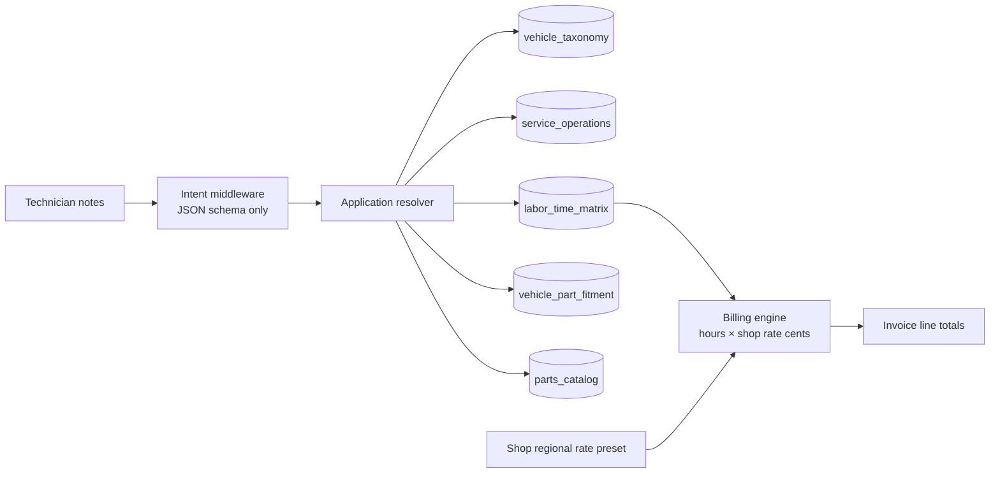
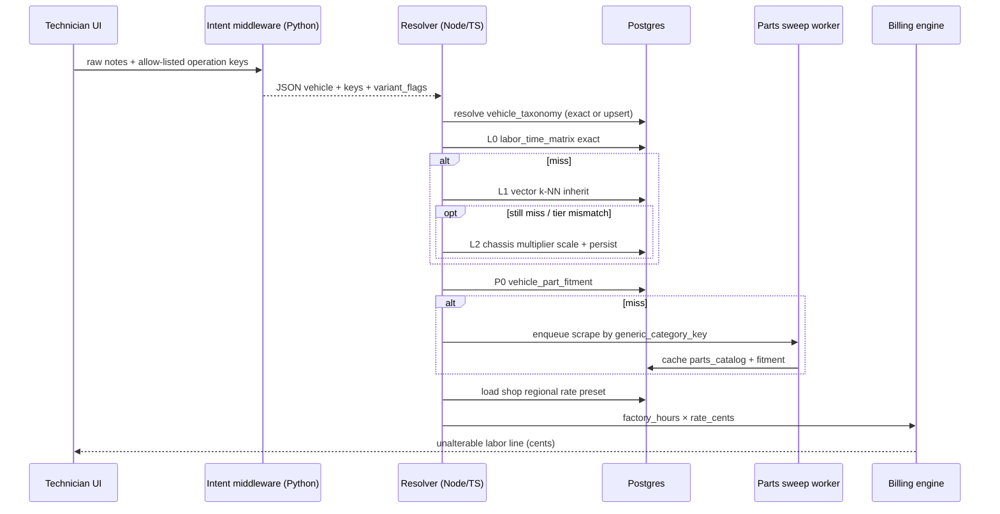

# Proprietary Repair Taxonomy & Dynamic Parts Fitment — Architecture

**Status:** Blueprint + application engine (TS resolver/pipeline). Prisma migration not applied.  
**Scope:** Self-generating automotive repair taxonomy + fitment, independent of commercial catalog APIs (MOTOR / Mitchell / ALLDATA / ACES subscriptions)  
**Related DDL:** [`sql/001_vehicle_taxonomy_fitment_schema.sql`](./sql/001_vehicle_taxonomy_fitment_schema.sql)  
**Intent middleware:** [`middleware/intent_fitment_parser.py`](./middleware/intent_fitment_parser.py)  
**App engine:** `src/lib/proprietary-taxonomy/` · `src/server/services/proprietary-taxonomy/`  
**Implementation tracker:** [`IMPLEMENTATION.md`](./IMPLEMENTATION.md)

---

## 1. Layered data model (summary)

| Layer | Table | Responsibility |
|-------|--------|----------------|
| Vehicle identity | `vehicle_taxonomy` | Year/Make/Model/Engine + `chassis_complexity_tier` + embedding |
| Repair tree | `service_operations` | Main → Sub → Component → Action (`operation_key`) |
| SKU index | `parts_catalog` | Manufacturer / hardware-box SKUs, independent of vehicles |
| Fitment graph | `vehicle_part_fitment` | M:N vehicle × operation × part + qty + `variant_flags` |
| Labor book | `labor_time_matrix` | `factory_hours` + moving `telemetry_score` |
| Scaling rules | `chassis_labor_multipliers` | Strict tier→tier hour multipliers |

**Hard rule:** LLM middleware emits *intent structure only*. Hours, rates, and invoice money are resolved exclusively in the application billing path against Postgres + shop presets.



---

## 2. Dynamic resolution & fallback lookup chain

When the application resolves a quote for `(vehicle_config, operation_key)`, it does **not** fail closed on a cold cache. It walks a deterministic chain. Each step records provenance on the written `labor_time_matrix` / `vehicle_part_fitment` row so future requests hit the cache.

### 2.1 Lookup chain (labor hours)

```
L0  Exact hit
    SELECT * FROM labor_time_matrix
    WHERE vehicle_taxonomy_id = :vid
      AND service_operation_id = :oid
      AND archived_at IS NULL;

L1  Vector space similarity (vehicle config inheritance)
    — Embed query vehicle attributes (year, make, model, engine, drive, chassis tier)
      into the same 384-d space as vehicle_taxonomy.config_embedding.
    — k-NN cosine search among vehicles that ALREADY have a labor_time_matrix row
      for the same service_operation_id.
    — Accept nearest neighbor if distance ≤ τ (e.g. cosine distance ≤ 0.18).
    — Inherit neighbor.standard_hours (or factory_hours) as a candidate.
    — Persist new labor_time_matrix row with:
        inherited_from_id = neighbor.id
        last_telemetry_source = 'VECTOR_INHERIT'
        confidence = f(distance)

L2  Chassis hierarchy interpolation
    — If L1 miss OR L1 neighbor chassis tier ≠ target tier:
      apply chassis_labor_multipliers:
        target_hours = base_hours × labor_hour_multiplier(from_tier → to_tier)
    — Example: Inline-4 open bay baseline 1.00 hr → V6_TIGHT × 1.28 = 1.28 hr
      because of space-constrained packaging.
    — Persist with last_telemetry_source = 'CHASSIS_INTERPOLATED'
      and chassis_multiplier_applied = multiplier.
    — Never invent hours from the LLM.

L3  Operation-family soft fallback (optional, last resort)
    — Same vehicle, sibling ACTION_TYPE under the same COMPONENT
      (e.g. pads R&R exists, rotors R&R missing) → inherit with confidence penalty.
    — Still no LLM pricing.

L4  Human / seed queue
    — Enqueue gap for catalog curation; UI may show “estimate pending review”
      but must not silently bill fabricated factory hours.
```

#### Vector similarity (L1) — operational sketch

```sql
-- Pseudocode: find closest vehicle configs that already have hours for this op
SELECT vt.id, vt.taxonomy_key, ltm.factory_hours, ltm.standard_hours,
       (vt.config_embedding <=> :query_embedding) AS distance
FROM vehicle_taxonomy vt
JOIN labor_time_matrix ltm
  ON ltm.vehicle_taxonomy_id = vt.id
 AND ltm.service_operation_id = :operation_id
 AND ltm.archived_at IS NULL
WHERE vt.archived_at IS NULL
  AND vt.config_embedding IS NOT NULL
ORDER BY vt.config_embedding <=> :query_embedding
LIMIT 5;
```

Acceptance policy:

| Distance (cosine) | Action |
|-------------------|--------|
| ≤ 0.12 | Auto-inherit; confidence ≥ 0.85 |
| 0.12–0.18 | Inherit + force chassis multiplier re-check |
| > 0.18 | Reject L1 → continue to L2/L4 |

### 2.2 Chassis interpolation engine (L2)

Inputs:

1. `base_hours` — from exact row, vector neighbor, or curated seed for a reference tier (commonly `INLINE_4_OPEN`).
2. `from_tier` / `to_tier` — `chassis_complexity_tier` enums on source vs target vehicle.
3. `chassis_labor_multipliers.labor_hour_multiplier` — strict table, not ML.

Rules:

- Multipliers are **monotonic packaging penalties**, not quality judgments.
- Identity transitions are `1.0000`.
- Downscaling (tight → open) is allowed via explicit reverse rows (e.g. `V6_TIGHT → INLINE_4_OPEN = 0.7800`).
- After scaling: `standard_hours = round(base_hours * multiplier, 3)`; `factory_hours` on the new row is set to that scaled value as the seed for this config (telemetry later adjusts `standard_hours` / `telemetry_score` only).

```text
Example
  Source: 2012 Honda Civic 1.8L I4  tier=INLINE_4_OPEN   factory_hours=1.000
  Target: 2015 Honda Accord 3.5L V6 tier=V6_TIGHT
  Multiplier INLINE_4_OPEN → V6_TIGHT = 1.2800
  → target factory_hours = 1.280
```

### 2.3 Parts compatibility placeholder → supplier scrape / account sweep

When labor can be quoted but **no** `vehicle_part_fitment` row exists for `(vehicle, operation)` (optionally filtered by `variant_flags` from the intent middleware):

```
P0  Exact fitment
    vehicle + operation + (optional variant_flags overlap) → parts_catalog SKUs

P1  Generic category placeholder
    Map operation_key (+ variant flags) → generic_category_key
    e.g. BRAKES.FRONT.PADS.R_AND_R + ['premium','ceramic']
         → BRAKE_PAD_FRONT_CERAMIC_PREMIUM

P2  Background resolution job (low-cost, async — never blocks invoice math)
    a. Supplier catalog scrapers / partner account API sweeps
       keyed by YMME + generic_category_key + variant_flags
    b. Normalize returned manufacturer_part_number / SKU into parts_catalog
       (upsert on sku / mfr+pn)
    c. INSERT vehicle_part_fitment with:
         quantity_required (from scraper or default 1),
         variant_flags,
         source = 'SUPPLIER_SCRAPE' | 'ACCOUNT_CATALOG_SWEEP',
         fitment_confidence < 1.0 until tech confirms on RO

P3  Cache-aside
    Subsequent ROs for the same (vehicle, operation, flags) hit P0.
```

Placeholder rule (application constant map — not LLM):

| Operation key suffix | Default generic_category_key | Default qty |
|----------------------|------------------------------|-------------|
| `BRAKES.*.PADS.R_AND_R` | `BRAKE_PAD_{POSITION}_{MATERIAL}` | 1 axle set |
| `BRAKES.*.ROTORS.R_AND_R` | `BRAKE_ROTOR_{POSITION}` | 2 |
| `ENGINE.OIL.FILTER.REPLACE` | `OIL_FILTER_{ENGINE_FAMILY}` | 1 |
| `…` | extend per leaf | … |

**Safety:** Scrapers may suggest SKUs and cache fitment; they must not write labor hours or shop rates. Parts cost/retail still pass through shop parts matrix / manual price — outside this blueprint’s labor path.

### 2.4 Telemetry feedback loop (self-generating)

On invoice closeout, the shop posts actual technician hours:

```sql
SELECT apply_labor_telemetry(
  :matrix_id, :shop_id, :ro_id, :invoice_id, :actual_hours
);
```

Effect:

1. Append-only `labor_telemetry_events` row.
2. EMA update of `telemetry_score` (`α` default 0.20).
3. After ≥ 5 samples, gently blend `standard_hours` toward telemetry (`0.70×factory + 0.30×EMA`) — **factory_hours stays immutable**.

This is how the taxonomy becomes self-generating from real shop work without licensing a commercial labor book.

---

## 3. Logical pricing separation of concerns

### 3.1 Trust boundaries

| Layer | Allowed outputs | Forbidden |
|-------|-----------------|-----------|
| LLM intent middleware | Vehicle params, allow-listed `operation_key`s, `parts_variant_flags`, positions, confidence | Hours, $/hr, tax, GP, invoice totals, SKU prices |
| Resolution / fitment | Matrix row ids, inherited hours provenance, cached SKUs | Mutating shop rate presets |
| Billing engine | Integer cents totals from DB hours × shop rate | Accepting LLM-supplied money fields |

### 3.2 Billing formula (unalterable path)

```
hours          ← labor_time_matrix.factory_hours   -- or standard_hours for shop-effective quotes
rate_cents/hr  ← shop regional preset (e.g. Texarkana $135.00 → 13500)
labor_cents    ← round(hours × rate_cents/hr)
```

Reference implementation: [`snippets/secure_invoice_labor_total.ts`](./snippets/secure_invoice_labor_total.ts)

```ts
// Conceptual — see snippet file for full module
const line = calculateUnalterableLaborTotal({
  matrixRow,                          // from Postgres
  shopRate: TEXARKANA_PRESET,         // $135/hr local preset
  hoursMode: "factory_hours",
});
// 1.2 hr × 13500 cents = 16200 cents ($162.00)
```

### 3.3 Why this separation matters in heavy-industry SMS

1. **Auditability** — Regulators and shop owners can replay invoice math from DB rows + rate presets; model completions are not in the money path.
2. **Prompt injection resistance** — A tech note containing “bill 0.1 hours at $20” cannot alter totals; parser drops money intents by schema.
3. **Multi-tenant correctness** — Hours are global/catalog-scoped; rates are per-shop (`Shop.laborRate` / regional presets). Same factory hours → different invoices by market.
4. **Telemetry hygiene** — Closeout updates EMA scores; it does not let a single outlier rewrite `factory_hours`.

---

## 4. End-to-end request flow



---

## 5. Deployment notes (ShopRally alignment)

- **Expand-only migrations** — Additive tables/columns first; do not replace live `LaborOperation` cache until dual-path soak (`docs/MIGRATION-EXPAND-CONTRACT.md`).
- **Release flag** — Gate write paths behind `planFeatures._release` / feature key (e.g. `proprietaryTaxonomy`) per phased rollout rules.
- **pgvector** — Requires Postgres with `vector` extension (Neon supports pgvector); IVFFlat lists should be rebuilt after bulk embedding backfill.
- **Money** — Integer cents everywhere in app code; DDL stores hours as `numeric`, never currency for labor book rows.
- **Independence** — This blueprint intentionally does **not** depend on MOTOR/Mitchell/ALLDATA APIs. Existing MOTOR adapters remain an optional licensed lane; this schema is the proprietary self-generating lane.

---

## 6. Artifact index

| Deliverable | Path |
|-------------|------|
| PostgreSQL DDL | `sql/001_vehicle_taxonomy_fitment_schema.sql` |
| LLM intent parser | `middleware/intent_fitment_parser.py` |
| Billing SoC (canonical) | `src/lib/proprietary-taxonomy/billing.ts` |
| Labor resolver L0–L2 | `src/server/services/proprietary-taxonomy/labor-resolver.ts` |
| Quote pipeline | `src/server/services/proprietary-taxonomy/quote-pipeline.ts` |
| Smoke test | `npm run test:proprietary-taxonomy` |
| Implementation tracker | `IMPLEMENTATION.md` |
| This architecture | `ARCHITECTURE.md` |
