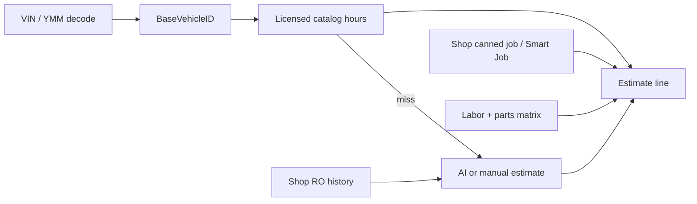

# AI Labor Guide — Datasets, Competitors & ShopRally Strategy

**Date:** 2026-07-07  
**Workspace:** ShopRally (`C:\Users\tabis\OneDrive\Documents\ClaudeCode\ShopRally`)  
**Status:** Research / design recommendation — no code changes  
**Related:** `docs/design/motor-taxonomy-ai-labor-integration.md`, `docs/design/labor-catalog-reference-plan.md`, `docs/SHOPRALLY-DEV.md`

---

## Executive summary

**There is no production-grade open dataset for automotive flat-rate labor taxonomy + hours.** Every serious shop CRM (Tekmetric, AutoLeap, Shopmonkey, Identifix, RoeWriter) anchors labor on **licensed catalogs** — primarily **MOTOR Estimated Work Times (EWT)**, with optional **Mitchell ProDemand**, **ALLDATA**, or **Identifix Direct-Hit** punch-outs. “AI labor guides” in marketing usually mean **search UX, canned-job assembly, or gap-fill estimation** layered on top of licensed data — not a replacement for MOTOR/Mitchell hours.

**Best dataset for ShopRally:** **MOTOR DaaS taxonomy + applications** (already integrated) as the **source of truth**, augmented by **shop-specific `LaborOperation` cache** and **scoped AI gap-fill** where MOTOR has no application row. Open sources (NHTSA, VCdb, scraped cost tables, community APIs) are useful for **vehicle identity** or **research only** — not for customer-facing flat-rate hours in a commercial CRM.

**Top recommendation:** Complete **M3 alignment** (MOTOR-ID cache keys, MOTOR RAG, taxonomy-scoped AI) and expand **per-vehicle MOTOR sync** — do **not** invest in open-data scraping or third-party “free labor guide” APIs for production estimates.

---

## 1. Comparison table — data sources

| Source | Taxonomy | Labor hours | License / cost | Used by CRMs | Fit for ShopRally |
|--------|----------|-------------|----------------|--------------|-------------------|
| **MOTOR DaaS EWT** | System → Group → SubGroup → LiteralName; 450+ ops; ACES-linked | ✅ Licensed EWT + optional OEM warranty times | Commercial DaaS subscription; sandbox dev-only | Tekmetric (primary), AutoLeap, Shopmonkey, Identifix (via Direct-Hit), RoeWriter (Epicor) | **✅ Primary SoT** — M1/M2 done; 846 apps synced for Civic `baseVehicleId=22124` |
| **Mitchell ProDemand** | ProDemand hierarchy (parts + labor + procedures) | ✅ Independent methodology; often 10–30% higher than OEM per AutoLeap blog | Shop subscription; CRM integration requires Mitchell partner agreement | Tekmetric (Grow/Scale tab), AutoLeap, Identifix Shop Manager | **🟡 Optional tier-2** — punch-out / transfer pattern; separate IDs from MOTOR |
| **ALLDATA Manage Online** | OEM repair-info hierarchy | ✅ OEM-published labor times | Per-shop ALLDATA subscription | Shopmonkey (OAuth), RoeWriter (info-only browser), Tekmetric ecosystem | **🟡 Optional punch-out** — no unified taxonomy with MOTOR; diagrams not always embeddable |
| **Identifix Direct-Hit** | Aggregated (MOTOR + Mitchell + OEM + 3M confirmed fixes) | ✅ Via bundled providers + proprietary confirmed-fix DB | Direct-Hit / Shop Manager subscription | Identifix Shop Manager, ShopCentral | **🟡 Diagnostic + labor bundle** — strong for confirmed fixes, not a drop-in MOTOR replacement |
| **Epicor / MOTOR (RoeWriter)** | Catalog labor lookup | ✅ Same MOTOR catalog family | Licensed with R.O. Writer | RoeWriter Smart Jobs / Labor Lookup | Same as MOTOR row |
| **VCdb / ACES / PCdb** (Auto Care) | Vehicle config + parts fitment taxonomy | ❌ No labor hours | Annual paid subscription (VIP portal) | Parts catalogs, ACES XML exchange | **🟡 Vehicle/parts bridge only** — MOTOR already uses ACES vehicle keys |
| **NHTSA vPIC** | None (VIN decode attributes) | ❌ | Public API | All CRMs for VIN → YMM | **✅ Already used** via `motor-vehicle.ts` / NHTSA fallback — not labor |
| **Open Labor Project** | Flat job list per vehicle | ⚠️ Claims 700K+ times; sources = “industry guides + community” | Free hobby API (50 req/day); paid tiers $49–$499/mo | None in tier-1 CRMs | **❌ Production risk** — provenance unclear; likely re-aggregated licensed data |
| **ARI (free AI labor app)** | Search-first, not MOTOR tree | ⚠️ AI-generated / aggregated | Free consumer app | Standalone mobile — not embedded in Tekmetric/AutoLeap | **❌ Not CRM-grade** — useful competitive reference for “AI gap-fill” UX only |
| **HuggingFace / shop invoice samples** | Service category codes (hashed) | ⚠️ `duration_minutes` from real ROs | Commercial license for full dataset | None publicly | **🟡 ML research** — shop-specific actuals, not industry flat-rate standard |
| **181K repair cost scrape** | Project name strings | ❌ Dollar ranges, not book hours | Unknown / scraped | None | **❌ Not flat-rate** — price estimates, no taxonomy |
| **Academic time-study papers** | N/A (assembly-line focus) | Methodology only | Open access | None in CRMs | **❌ Wrong domain** — manufacturing PMTS, not auto flat-rate |
| **ASA / industry surveys** | N/A | Prevailing **hourly rates**, not per-job book time | Member publications | Insurers, state boards | **🟡 Regional rate context** — not operation taxonomy |
| **ShopRally `LaborOperation`** | Custom `LABOR_CATEGORY_TREE` (legacy) → MOTOR FKs (M3) | AI cache + MOTOR write-through | Own data | ShopRally only | **✅ Secondary cache + shop intelligence** — grows from real searches |

---

## 2. Licensed industry catalogs (production reality)

### MOTOR Estimated Work Times — **ShopRally’s anchor**

MOTOR EWT is the de facto North American standard for mechanical flat-rate times:

- **Taxonomy:** DrillDown `System → Group → SubGroup` + application rows with `LiteralName`, `OperationType`, position qualifiers, vehicle-config filters (`BR`, `EN`, `DT`, etc.).
- **Coverage:** 1985+ US light-duty (Tekmetric cites 1984; Shopmonkey 1990–present); 450+ common operations.
- **Delivery:** REST DaaS (JSON/XML); ACES `BaseVehicleID` linkage.
- **Methodology:** Proprietary — OEM procedures + expert validation + decades of field research ([MOTOR EWT product sheet](https://www.motor.com/products-services/data-products/estimated-work-times/)).

**ShopRally status:**

| Milestone | State | Evidence |
|-----------|-------|----------|
| M1 Taxonomy sync | ✅ Done | `MotorCatalogNode`, `sync-motor-taxonomy.ts`, Labor Book MOTOR sidebar |
| M2 Application sync | ✅ Done | `MotorCatalogApplication`, 846 apps / 144 subgroups for Civic 22124 |
| M3 AI alignment | 🎯 In progress | `LaborOperation` MOTOR FKs, `motor-ai-context.ts`, `shoprally-v3-motor-context` prompt |
| Production license | ⚠️ Pending | Sandbox keys in dev; commercial DaaS required before customer-facing licensed hours |

### Mitchell ProDemand

- **Taxonomy:** Mitchell-owned hierarchy; labor + parts + TSBs + wiring + ADAS in one UI.
- **Hours:** Independent teardown/time-study methodology; commonly cited as higher than OEM for customer-pay independents.
- **CRM pattern:** Optional tab or punch-out — Tekmetric transfers parts/labor/maintenance/fluids side-by-side; AutoLeap and Identifix Shop Manager support Mitchell transfer into RO lines.
- **Fit:** Second provider toggle for shops already paying Mitchell — **do not merge Mitchell IDs into MOTOR tree**.

### ALLDATA Manage Online

- **Taxonomy:** OEM repair-information hierarchy (differs naming from MOTOR — e.g. RWD vs 2WD).
- **Hours:** OEM labor times from manufacturer service information.
- **CRM pattern:** OAuth punch-out (Shopmonkey) or browser-only reference (RoeWriter 3.1 — **no labor transfer back**).
- **Fit:** Shops with existing ALLDATA subs; low priority until MOTOR coverage gaps are documented.

### Identifix Direct-Hit

- **Taxonomy:** Multi-provider aggregation + **3M+ technician-confirmed fixes** (diagnostic-first, not flat-rate-first).
- **Hours:** MOTOR/Mitchell/OEM bundled; value prop is confirmed repair patterns, not unique hour methodology.
- **CRM pattern:** Native in Identifix Shop Manager; Mitchell also offered as second KB.
- **Fit:** Competitive reference for **diagnostic AI + labor** bundling — ShopRally’s AI labor is estimate-focused, not DTC-confirmed-fix.

### What tier-1 CRMs actually use

| CRM | Primary labor data | “AI” / smart layer | Browse vs search |
|-----|-------------------|-------------------|------------------|
| **Tekmetric** | MOTOR (fluids/filters/blades + labor guide to ~1984) | **Smart Jobs** — one-click canned jobs auto-populate MOTOR labor + PartsTech parts + matrices; optional **ProDemand tab** (Grow/Scale) | Taxonomy tree in Labor Guide popup + search + Smart Jobs list |
| **AutoLeap** | MOTOR + Mitchell1 (integrated transfer) | **Canned services** (shop templates); **AIR** = AI phone receptionist, **not** AI labor hours | MOTOR/Mitchell browse + canned job search typeahead |
| **Shopmonkey** | Native MOTOR (1990–present) | Service Guides category browse; optional ALLDATA provider switch | Search All Services → Service Guides hierarchy |
| **Identifix Shop Manager** | Direct-Hit (multi-provider) + optional Mitchell | Confirmed-fix search; estimator modal with provider buttons | Provider-specific browse + transfer |
| **RoeWriter** | Epicor/MOTOR catalog labor | Smart Jobs with catalog labor lookup; ALLDATA info-only | Configuration → Labor Lookup → ticket Labor Guide button |

**Pattern:** Licensed catalog = hours. AI/smart = **job assembly**, **search ranking**, **matrix pricing**, **parts pairing** — or **scoped estimation when catalog misses**. No major CRM trains a public LLM on scraped Mitchell/MOTOR text.

---

## 3. Open / research datasets — reality check

### Usable for ShopRally (non-labor)

| Dataset | What you get | Labor? | Verdict |
|---------|--------------|--------|---------|
| **NHTSA vPIC** | VIN decode, make/model/engine, recalls | ❌ | ✅ Keep for vehicle resolution |
| **VCdb / ACES** | `BaseVehicleID`, configs, part terminology | ❌ | ✅ MOTOR already ACES-aligned; optional if building PartsTech ACES fitment |
| **NHTSA recall flat files** | Campaign data | ❌ | ✅ Customer-facing recall flags only |

### Not usable for production labor taxonomy

| Dataset | Problem |
|---------|---------|
| **Open Labor Project** | Marketing claims “free forever” labor times from “industry guides + community submissions.” No auditable chain of title; CRM use would expose ShopRally to **derivative copyright risk** if data traces to MOTOR/Mitchell. Fine for hobby lookups — **not SoT**. |
| **ARI free AI labor** | Mobile-first AI search; no MOTOR-grade taxonomy tree; standalone from shop CRMs. Good UX reference for “type symptom → get hours” — **not licensed catalog replacement**. |
| **181K repair cost DB** | High/low **dollar** labor price ranges by project name; no vehicle config depth, no book hours, unknown scrape provenance. |
| **HuggingFace automotive-service sample** | Real `duration_minutes` from anonymized ROs — **actual shop time**, not industry flat-rate; full data requires commercial license; hashed categories, not MOTOR taxonomy. Useful for **efficiency analytics** (“book vs actual”), not estimate SoT. |
| **Kaggle** | No maintained flat-rate labor taxonomy dataset found (2024–2026 search). |
| **Academic repair time studies** | Rare; most literature is manufacturing assembly (chronoanalysis, PMTS) — wrong methodology for collision/mechanical flat-rate. |
| **ASA publications** | Focus on **shop labor rate** surveys and management — not per-operation book times. |

### Key insight

Government and open-data initiatives **do not publish flat-rate mechanical labor standards**. Book time is a **commercial publishing product** (MOTOR, Mitchell, ALLDATA, Chilton heritage) built from proprietary teardown studies and OEM relationships. Expecting an open Kaggle equivalent is a category error.

---

## 4. AI labor guide patterns in CRMs (2024–2026)

### How competitors combine catalog + AI + shop matrix



| Layer | Typical implementation | ShopRally equivalent |
|-------|------------------------|----------------------|
| **Catalog SoT** | MOTOR EWT per vehicle config | `MotorCatalogApplication` |
| **Taxonomy browse** | MOTOR/Mitchell tree in labor popup | `MotorCatalogNode` + Labor Book MOTOR mode |
| **Flat search** | `SearchTerm` API + chips | `searchLaborGuide`, popular chips |
| **Canned / Smart Jobs** | Pre-built job packages (Tekmetric Smart Jobs, AutoLeap canned services) | Shop canned jobs (separate module) + future MOTOR-backed smart jobs |
| **Matrix pricing** | Labor/parts matrix on catalog hours | Shop settings matrices (existing) |
| **AI gap-fill** | Rare in tier-1 CRMs; ARI mobile; some “suggested jobs” | `suggestLaborJob` + `LaborOperation` cache |
| **Training data** | Proprietary RO history + licensed feeds (never disclosed as scrape) | `LaborOperation` hit counts + MOTOR RAG metadata |

### Taxonomy tree vs flat search

- **Production CRMs use both:** Left-rail or accordion **taxonomy** (MOTOR/ProDemand pattern) **plus** prominent **search bar** (Tekmetric pattern).
- **Position/qualifiers** live on **application rows**, not taxonomy nodes — matches ShopRally M2 model.
- **AI does not replace tree navigation** — it fills holes when browse/search returns zero rows or shop wants non-catalog wording.

### What “AI labor guide” marketing usually means

| Claim | Reality |
|-------|---------|
| “World’s first AI labor guide” (ARI, blog SEO) | AI **search/estimate** over aggregated or generated hours — not MOTOR-class catalog |
| “AI receptionist” (AutoLeap AIR) | Phone/booking — unrelated to book times |
| “Smart Jobs” (Tekmetric) | **Rules + MOTOR data + canned templates** — branded “smart,” not LLM-trained on open data |
| Tekmetric Digital Ads “AI-powered” | Marketing/ads product — not labor |

---

## 5. ShopRally current assets

### Database / sync

| Asset | Scale (Civic 22124) | Role |
|-------|---------------------|------|
| `MotorCatalogNode` | Full DrillDown tree | Browse scaffold (M1) |
| `MotorCatalogApplication` | **846 applications**, 144 subgroups, 8 systems | Licensed hours grid (M2) |
| `LaborOperation` | Global cache; MOTOR FKs + dual unique keys | AI + MOTOR write-through cache (M3) |

System distribution (22124): Powertrain 414, Body & Frame 120, Brakes 84, Electrical 69, HVAC 69, Suspension 54, Steering 25, Vehicle 11.

### Code paths

| File | Role |
|------|------|
| `src/server/services/motor/motor-taxonomy.ts` | Taxonomy fetch + persist |
| `src/server/services/motor/motor-applications.ts` | SubGroup application sync |
| `src/server/services/motor/motor-labor.ts` | Runtime EWT Summaries search |
| `src/server/services/motor/motor-ai-context.ts` | MOTOR RAG few-shot (metadata only) |
| `src/server/services/motor/motor-node-assignment.ts` | Post-AI MOTOR node assignment |
| `src/server/labor-guide-cache.ts` | Cache-first `lookupLaborSuggestion` |
| `src/lib/labor-guide-prompt.ts` | `shoprally-v3-motor-context` — first-principles + assembly rules |
| `scripts/build-labor-dataset.ts` | Curated vehicle × job matrix → same lookup path (AI seed) |
| `scripts/sync-motor-taxonomy.ts` / `sync-motor-applications.ts` | Batch sync CLIs |

### Resolver precedence (target — M3)

```
1. MotorCatalogApplication exact match (motorApplicationId)
2. LaborOperation cache by (baseVehicleId, motorApplicationId)
3. LaborOperation cache by legacy (vehicleKey, queryKey)
4. MOTOR live SearchTerm API
5. AI + MOTOR RAG examples (fetchMotorRagExamples)
6. AI + LaborOperation history RAG
7. First-principles AI fallback
```

### Legacy overlay (deprecating)

- `LABOR_CATEGORY_TREE` + `classifyOperation()` — custom 18-system tree, **not licensed MOTOR**.
- `enrichHitClassification()` — forces MOTOR hits into custom tree; **skip when `motorApplicationId` set** (M3.6).

---

## 6. Recommended stack for ShopRally

### Source of truth

**MOTOR DaaS taxonomy + applications per `baseVehicleId`.**

- Browse: `MotorCatalogNode` tree → `MotorCatalogApplication` grid.
- Hours on estimate: always prefer `dataSource: motor_ewt` when application exists.
- Expand sync: top shop fleet vehicles via Inngest batch job (M2 remaining item).

### AI training / context (not fine-tuning)

| Input | Use | Do not |
|-------|-----|--------|
| MOTOR application metadata | Few-shot RAG in `fetchMotorRagExamples` | Paste `rawJson` / included-operation prose into prompts |
| Taxonomy names + IDs | `buildMotorTaxonomyPromptBlock` for scoped generate | Bulk-export MOTOR for model training |
| `LaborOperation` history | Similar-job RAG, hit-count refresh priority | Treat AI cache as override for licensed hours |
| Shop canned jobs | Package MOTOR rows + shop notes | Re-key canned jobs only on fuzzy text |

### Fallback

**First-principles Claude** (`suggestLaborJob`) when:

- SubGroup has zero synced applications.
- Search term has no MOTOR match.
- Vehicle has no `baseVehicleId` resolution.

Label: `dataSource: ai_motor_scoped` (browse context known) or `ai_first_principles` (legacy).

### Optional future providers

| Provider | When | Integration style |
|----------|------|-------------------|
| Mitchell ProDemand | Shop requests, Tekmetric parity | Separate tab / OAuth punch-out — transfer labor lines, don’t merge taxonomy |
| ALLDATA | Shop requests | OAuth punch-out like Shopmonkey |
| Direct-Hit | Diagnostic bundle upsell | Partner API — confirmed fixes, not primary hours |

### Do not pursue

- Scraping Open Labor Project / cost-aggregator sites into `LaborOperation`.
- Building a parallel open taxonomy — MOTOR tree **is** the industry interchange format for EWT.
- Fine-tuning on MOTOR `rawJson` or Mitchell exports.

---

## 7. Phased leverage plan (aligned with M1–M3)

| Phase | Status | Dataset leverage |
|-------|--------|------------------|
| **M1 — Taxonomy browse** | ✅ Done | MOTOR DrillDown → `MotorCatalogNode`; Labor Book sidebar |
| **M2 — Application sync** | ✅ Done (CLI) | SubGroup Summaries → `MotorCatalogApplication`; 846 Civic rows prove pipeline |
| **M2b — Fleet sync job** | ⬜ Next ops | Inngest: sync top N `baseVehicleId`s from shop fleet nightly |
| **M3 — AI alignment** | 🎯 Active | MOTOR FKs on `LaborOperation`; MOTOR RAG; taxonomy prompt; node assignment |
| **M3.9 — Seed script pivot** | ⬜ | `build-labor-dataset.ts`: MOTOR-first for synced vehicles; AI only for SubGroup gaps |
| **M4 — Smart Jobs** | ⬜ Future | Canned packages over MOTOR apps (Tekmetric Smart Jobs parity) |
| **M5 — Mitchell toggle** | ⬜ Optional | ProDemand punch-out for Grow-tier parity |
| **Production** | ⬜ Gate | Commercial MOTOR DaaS license before licensed hours in customer UI |

### M3 exit criteria (from integration doc)

- Generate “Brake Pads R&R” on Civic 22124 → `motorSubGroupId=44`, cache keyed by MOTOR IDs.
- MOTOR grid rows skip `classifyOperation`.
- UI shows `motor_ewt` vs `ai_motor_scoped` provenance.

---

## 8. Legal and licensing warnings

| Risk | Guidance |
|------|----------|
| **MOTOR sandbox in production** | Sandbox keys and synced data are **dev/prototype only**. Commercial DaaS agreement required for customer-facing licensed hours and persistent redistribution. |
| **Storing MOTOR content** | `MotorCatalogNode`, `MotorCatalogApplication`, `rawJson` require license. Metadata-minimal RAG (literalName, hours, position) is lower risk but still bound by DaaS terms. |
| **AI training on MOTOR/Mitchell text** | **Prohibited** without explicit generative license — includes fine-tuning, bulk prompt stuffing, embedding full included-operation paragraphs. |
| **AI overriding licensed hours** | When `MotorCatalogApplication` exists, **never** replace `estimatedHours` with AI output silently. |
| **Open Labor Project / scraped datasets** | Unknown provenance; potential derivative of copyrighted guides. Do not import into production `LaborOperation`. |
| **VCdb / ACES** | Separate Auto Care subscription — required for ACES XML product fitment, not for MOTOR labor (MOTOR bundles ACES vehicle lookup). |
| **Shop RO data** | ShopRally `LaborOperation` cache is ShopRally/shop derivative data — usable for shop-specific RAG; don’t sell as industry flat-rate guide. |
| **Mitchell / ALLDATA punch-out** | Labor times remain under shop’s provider subscription; CRM is transfer UI only. |

---

## 9. Answers to research goals

### 1. Licensed industry catalogs

**Production CRMs run on MOTOR first**, with Mitchell/ALLDATA as optional second sources. Tekmetric Smart Jobs explicitly builds on MOTOR data + PartsTech + shop matrices. ShopRally is correctly positioned with MOTOR DaaS already integrated.

### 2. Open / research datasets

**Nothing open provides MOTOR-equivalent taxonomy + hours.** NHTSA/VCdb solve vehicle identity. Community APIs and cost scrapes are research-only or high legal risk.

### 3. AI labor guide patterns

**Licensed catalog + taxonomy browse + flat search + canned jobs + matrices.** AI is gap-fill and UX, not replacement. Training data is proprietary licensed feeds + shop history.

### 4. ShopRally current assets

**Strongest moat:** synced `MotorCatalogNode` + `MotorCatalogApplication` + M3 MOTOR FKs on `LaborOperation` + `motor-ai-context.ts` RAG. Weakest legacy piece: `LABOR_CATEGORY_TREE` overlay — retire for MOTOR-aligned paths.

---

## 10. References

- [MOTOR Estimated Work Times](https://www.motor.com/products-services/data-products/estimated-work-times/)
- [Tekmetric Smart Jobs launch (MOTOR)](https://www.motor.com/2023/11/tekmetric-launches-smart-jobs-industrys-first-one-click-job-building-feature/)
- [Tekmetric Labor Guide + ProDemand tab](https://support.tekmetric.com/hc/en-us/articles/360063488693-Labor-Guide)
- [AutoLeap MOTOR integration](https://autoleap.com/partners/motor/)
- [Shopmonkey MOTOR Parts & Labor Lookup](https://support.shopmonkey.io/hc/en-us/articles/38743038698388-Vehicle-Parts-Labor-Lookup)
- [Identifix Mitchell integration](https://support.shopmanager.identifix.com/support/solutions/articles/43000721886-mitchell1-integration)
- [RoeWriter Epicor Labor Lookup](https://docs.rowriter.com/v3.0/Content/Epicor/Epicor_Labor_Lookup.htm)
- [Auto Care VCdb](https://www.autocare.org/data-and-information/data-standards/databases/vehicle-configuration-database-vcdb)
- [NHTSA Datasets and APIs](https://www.nhtsa.gov/nhtsa-datasets-and-apis)
- ShopRally: `docs/design/motor-taxonomy-ai-labor-integration.md`, `docs/SHOPRALLY-DEV.md`

---

## Quick reference — parent agent

| Question | Answer |
|----------|--------|
| Best dataset to leverage? | **MOTOR DaaS EWT** + shop `LaborOperation` cache |
| Open scrape viable? | **No** for production |
| Top recommendation | **Finish M3**; expand fleet MOTOR sync; obtain production MOTOR license |
| Competitor AI secret? | **Not public LLM training** — MOTOR/Mitchell + canned jobs + matrices |
