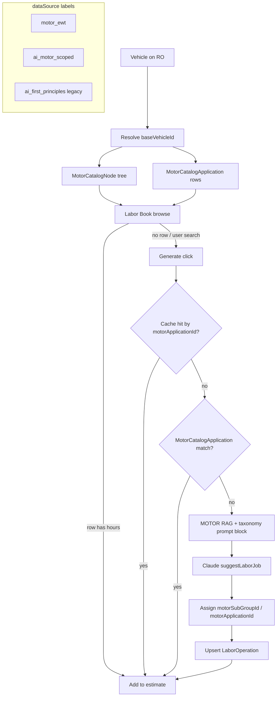

# MOTOR Taxonomy × AI Labor Integration

**Date:** 2026-07-07  
**Workspace:** ShopRally (`C:\Users\tabis\OneDrive\Documents\ClaudeCode\ShopRally`)  
**Status:** Design recommendation — no schema changes in this doc  
**Related:** `docs/design/labor-catalog-reference-plan.md`, `docs/SHOPRALLY-DEV.md`

---

## Executive summary

**Yes — MOTOR taxonomy can and should anchor AI labor in ShopRally**, with a **licensing caveat**: taxonomy node names, application rows, and licensed hours may be stored and displayed only under a **MOTOR DaaS commercial license** (sandbox is dev-only). AI remains the **fallback estimator** for misses — it must not be trained on or prompted with copyrighted MOTOR text wholesale, but it **can** use MOTOR **structure** (System / Group / SubGroup IDs and names) plus **licensed application metadata** as browse context and few-shot RAG when the license permits.

M1 (taxonomy browse) and M2 (application sync) are **implemented**. M3 aligns AI generation, cache keys, and classification to MOTOR nodes instead of the custom `LABOR_CATEGORY_TREE` overlay.

---

## 1. Can we use MOTOR taxonomy for AI labor?

| Question | Answer |
|----------|--------|
| **Use taxonomy tree as browse scaffold?** | **Yes** — `MotorCatalogNode` + `getMotorCatalogTree` already power Labor Book MOTOR mode. |
| **Use taxonomy IDs in AI prompts?** | **Yes** — pass System / Group / SubGroup **names** (and optionally IDs) as structured context; do not dump full MOTOR prose. |
| **Use MOTOR applications as RAG examples?** | **Yes, with license** — few-shot hours from `MotorCatalogApplication` for same `baseVehicleId` + SubGroup; label `dataSource: motor_ewt`. |
| **Replace `classifyOperation` with MOTOR assignment?** | **Yes for catalog/AI-aligned rows** — assign `motorSubGroupId` post-AI via taxonomy match; keep keyword classify only for legacy AI rows during hybrid. |
| **Change cache key to MOTOR IDs?** | **Yes for aligned rows** — prefer `(baseVehicleId, motorApplicationId)` when licensed app exists; `(baseVehicleId, motorSubGroupId, literalName)` for AI-only fills under a SubGroup. |

**Licensing caveat (non-negotiable):**

- **Sandbox** (`motor.com/daas-sandbox`) — prototype sync and UI only.
- **Production** — MOTOR DaaS subscription required before persisting taxonomy, applications, or displaying licensed hours to shop users.
- **AI prompts** — current `LABOR_GUIDE_SYSTEM_PROMPT` forbids referencing proprietary guides; M3 adds **licensed-context** prompt variant only when `dataSource` chain is MOTOR-licensed, never for bulk fine-tuning on MOTOR content.

---

## 2. Current state (audit)

### MOTOR taxonomy (M1 — done)

| Artifact | Role |
|----------|------|
| `src/server/services/motor/motor-taxonomy.ts` | DrillDown fetch, `MotorCatalogNode` upsert, `getMotorCatalogTree` |
| `prisma` → `MotorCatalogNode` | Per-`baseVehicleId` System / Group / SubGroup rows, `nodeKey` = `22124\|s\|2\|g\|17\|sg\|44` |
| `scripts/sync-motor-taxonomy.ts` | CLI sync + JSON snapshot under `prisma/data/` |
| `src/lib/labor-book-motor-adapter.ts` | Maps tree → Labor Book sidebar |
| `src/server/actions/labor-book-motor.ts` | `getLaborBookMotorInit`, `getLaborBookMotorTree`, MOTOR vs shop-library mode |
| `src/components/repair-order/smart-labor-guide.tsx` | MOTOR branch: accordion browse → SubGroup → grid |

### MOTOR applications (M2 — done)

| Artifact | Role |
|----------|------|
| `src/server/services/motor/motor-applications.ts` | SubGroup-scoped Summaries fetch, `MotorCatalogApplication` persist |
| `prisma` → `MotorCatalogApplication` | `motorApplicationId`, hours, `literalName`, `positionQualifier`, qualifiers JSON |
| `scripts/sync-motor-applications.ts` | Batch sync per SubGroup |
| `getLaborBookMotorApplications` | Grid rows via `motorApplicationsToGridRows` |

### AI labor today (pre-M3)

| Step | Implementation |
|------|----------------|
| User clicks **Generate** | `generateLaborSuggestion` → `lookupLaborSuggestion` |
| Cache lookup | `LaborOperation` unique on `(vehicleKey, queryKey)` — fuzzy normalized text |
| Catalog on miss | `findCatalogLaborSuggestion` → MOTOR Summaries `SearchTerm` (`motor-labor.ts`) |
| AI on catalog miss | `resolveLaborSuggestionWithFallback` → `suggestLaborJob` (Claude) |
| RAG today | `fetchRagExamples` — **3 similar `LaborOperation` rows**, not MOTOR apps |
| Prompt | `src/lib/labor-guide-prompt.ts` — first-principles; **no commercial guide refs** |
| Classification | `classifyOperation` + `enrichHitClassification` — keyword map into **custom** `LABOR_CATEGORY_TREE` |
| Bulk seed | `scripts/build-labor-dataset.ts`, `build-ny-labor-library.ts` → same `lookupLaborSuggestion` path |

### Classic Labor Book — three branches

```
SmartLaborGuide open
├── MOTOR mode (motorSource === "motor", tree synced)
│   └── Sidebar: System → Group → SubGroup → MotorCatalogApplication grid (licensed hours)
├── Shop library mode (fallback)
│   └── LABOR_CATEGORY_TREE + SUBCATEGORY_NAV facets + cached LaborOperation browse
└── Search / Generate (both modes)
    └── Cache search ($0) → explicit Generate → lookupLaborSuggestion → MOTOR search → AI
```

MOTOR runtime adapter (`motor-labor.ts`) still runs **`enrichHitClassification`** on every hit — forcing licensed rows into the **custom** tree. That is the main friction M3 removes.

---

## 3. Integration patterns (how)

### Pattern A — Taxonomy as browse scaffold; AI fills gaps

**When:** User browses to a SubGroup with **no** synced applications (or partial coverage).

**Flow:**

1. User selects **Brakes → Disc Brakes → Brake Pads** (`motorSubGroupId`).
2. Load `MotorCatalogApplication` rows; if empty, show SubGroup header + **“Estimate with AI”** for operations listed in taxonomy metadata (literal names from sibling vehicles or user-typed job).
3. AI call scoped: `vehicle + motorSubGroupId + literalName` (not free-text `queryKey` only).
4. Persist cache with `motorSubGroupId`, `motorSystemId`, `motorGroupId`, `dataSource: ai_motor_scoped`.

**Benefit:** Browse IA matches Tekmetric/AutoLeap; AI only runs where MOTOR has no application row.

### Pattern B — Taxonomy names in prompt context

**When:** AI generate from search box or SubGroup gap-fill.

**Add to user prompt block (structured, minimal):**

```
MOTOR taxonomy context:
  System: Brakes (SystemID=2)
  Group: Disc Brakes (GroupID=17)
  SubGroup: Brake Pads (SubGroupID=44)
Target operation: Brake Pads R&R
Position hint: Front
```

**Rules:**

- Include **names + numeric IDs** for machine-parseable post-assignment.
- Do **not** paste MOTOR `rawJson`, included-operation paragraphs, or full qualifier prose into the prompt unless license explicitly allows generative use (default: **metadata only**).
- Extend `LABOR_GUIDE_PROMPT_VERSION` → `shoprally-v3-motor-context` when this ships.

**Files:** `src/lib/labor-guide-prompt.ts`, `src/server/services/labor-guide.ts` (`buildVehiclePrompt`), new helper `buildMotorTaxonomyPromptBlock(baseVehicleId, subGroupId)`.

### Pattern C — RAG from MOTOR applications (not just LaborOperation)

**When:** AI call after catalog miss but **before** pure first-principles.

**Retriever (new):**

1. Resolve `baseVehicleId` from vehicle.
2. Query `MotorCatalogApplication` where `motorSubGroupId` matches classified or selected SubGroup (or semantic match on `literalName` / `SearchTerm`).
3. Pass top 3 rows as few-shot: `literalName`, `estimatedHours`, `positionQualifier`, `operationType` — **no rawJson bodies**.

**Precedence ladder (updated):**

```
1. MotorCatalogApplication exact match (motorApplicationId)
2. LaborOperation cache (vehicleKey, motorApplicationId) or legacy (vehicleKey, queryKey)
3. MOTOR live SearchTerm (existing)
4. AI with MOTOR RAG examples (new)
5. AI with LaborOperation RAG (existing)
6. Assembly / generic fallback
```

**Files:** `src/server/services/labor-guide-resolver.ts` (`fetchRagExamples` → `fetchMotorRagExamples`), optional `src/server/services/motor/motor-ai-context.ts`.

### Pattern D — Post-AI MOTOR node assignment (replace keyword classify)

**When:** AI returns `jobName` + hours.

**Instead of** `classifyOperation(jobName)` → `brakes-pads`:

1. Match `jobName` + optional position to `MotorCatalogApplication.literalName` / `operationType` within vehicle SubGroups.
2. If match: set `motorApplicationId`, `motorSubGroupId`, `categoryPath` from `MotorCatalogNode` names.
3. If no app match but SubGroup known from browse: assign SubGroup only (`ai_motor_subgroup`).
4. Else: legacy `classifyOperation` for hybrid period.

**Deprecate** `enrichHitClassification` for rows with `motorApplicationId != null`.

**Files:** `src/lib/labor-categories.ts` (guard), new `src/server/services/motor/motor-node-assignment.ts`.

### Pattern E — Cache keys anchored to MOTOR IDs

**Today:** `@@unique([vehicleKey, queryKey])` — collisions, re-classify on read, weak dedup.

**Target (additive columns on `LaborOperation`):**

| Row type | Primary cache key | Secondary |
|----------|-------------------|-----------|
| Licensed MOTOR | `(baseVehicleId, motorApplicationId)` | `vehicleKey` for YMM fast path |
| AI under SubGroup | `(baseVehicleId, motorSubGroupId, normalizedLiteralName)` | `queryKey` for search UX |
| Legacy AI | `(vehicleKey, queryKey)` | until backfill |

**Write-through:** On MOTOR app add-to-estimate, upsert `LaborOperation` with `dataSource: motor_ewt`, `source: catalog`, skip AI.

**Index:** `@@unique([baseVehicleId, motorApplicationId])` nullable; keep existing unique for legacy.

---

## 4. What changes (priority order)

| Priority | Milestone | Files / services |
|----------|-----------|------------------|
| **P0** | Schema: MOTOR FKs on `LaborOperation` | `prisma/schema.prisma`, migration |
| **P1** | MOTOR RAG retriever | `motor-ai-context.ts`, `labor-guide-resolver.ts` |
| **P2** | Taxonomy prompt block | `labor-guide-prompt.ts`, `labor-guide.ts` |
| **P3** | Post-AI node assignment | `motor-node-assignment.ts`, `labor-guide-resolver.ts` |
| **P4** | Cache upsert by `motorApplicationId` | `labor-guide-cache.ts` (`upsertLaborCacheRows`) |
| **P5** | Skip `enrichHitClassification` for MOTOR hits | `motor-labor.ts`, `labor-guide-cache.ts` |
| **P6** | SubGroup gap-fill UI (“AI estimate”) | `smart-labor-guide.tsx`, `labor-book-motor.ts` |
| **P7** | Search: MOTOR SubGroup-scoped before AI | `labor-guide.ts`, `labor-guide-catalog.ts` |
| **P8** | Bulk scripts: MOTOR-first matrix | `build-labor-dataset.ts` (deprioritize blind AI) |
| **P9** | Remove hybrid `classifyOperation` for MOTOR rows | `labor-categories.ts`, `SUBCATEGORY_NAV` (later) |

**Already done (no rework):** `motor-taxonomy.ts`, `motor-applications.ts`, `labor-book-motor.ts`, `labor-book-motor-adapter.ts`, sync scripts, `MotorCatalogNode` / `MotorCatalogApplication` models.

---

## 5. What NOT to do

| Don't | Why |
|-------|-----|
| Train / fine-tune models on MOTOR `rawJson`, included-operation text, or bulk exports | Copyright + license violation |
| Paste full MOTOR application detail into AI prompts by default | Same; use metadata-only RAG |
| Use sandbox-synced MOTOR data in production customer UI | Sandbox ≠ redistribution rights |
| Replace MOTOR licensed hours with AI when `MotorCatalogApplication` exists | AI must not silently override `motor_ewt` |
| Keep `LABOR_CATEGORY_TREE` as SoT after M3 | Duplicates MOTOR tree; double maintenance |
| Key AI cache only on fuzzy `queryKey` once MOTOR IDs available | Causes duplicates (“front brake pads” vs “brake pads front”) |
| Run AI on debounced search | Existing rule — Generate button only ($0 cache search first) |
| Merge Mitchell / ALLDATA taxonomies into MOTOR tree | Separate provider toggles; different IDs |

---

## 6. Recommended architecture

ShopRally should treat **MOTOR taxonomy + applications as the canonical catalog shape** and **AI as a scoped gap-fill** keyed to `baseVehicleId` and `motorSubGroupId`. The Labor Book sidebar reads `MotorCatalogNode`; the grid reads `MotorCatalogApplication`; only misses invoke AI with taxonomy-aware prompts and MOTOR-sourced RAG. `LaborOperation` remains a YMM-primary **denormalized cache** but gains MOTOR foreign keys so rows dedupe on `motorApplicationId` instead of brittle text. Keyword `classifyOperation` survives briefly for legacy AI rows and shop canned jobs without `motorTaxonomyId`, then retires for catalog-sourced paths.



---

## 7. Phased plan

### M1 — Taxonomy browse ✅ Done

- [x] `MotorCatalogNode` + DrillDown sync
- [x] `getMotorCatalogTree` + dev page `/dev/motor-taxonomy`
- [x] Labor Book MOTOR sidebar (`getLaborBookMotorInit`, `mapMotorTreeToSidebar`)
- [x] Fallback to shop library when taxonomy empty

### M2 — Application sync ✅ Done

- [x] `MotorCatalogApplication` + SubGroup-scoped Summaries sync
- [x] `getLaborBookMotorApplications` → grid rows
- [x] Position on application row (`positionQualifier`), not taxonomy level
- [ ] **Remaining:** production on-demand sync job (Inngest), top-vehicle batch coverage

### M3 — AI alignment 🎯 Next

| # | Task | Outcome |
|---|------|---------|
| 3.1 | `LaborOperation` + `baseVehicleId`, `motorApplicationId`, `motorSubGroupId`, `motorSystemId`, `motorGroupId` | Stable cache dedup |
| 3.2 | `fetchMotorRagExamples(baseVehicleId, subGroupId, request)` | MOTOR few-shot before AI |
| 3.3 | `buildMotorTaxonomyPromptBlock` in `suggestLaborJob` | AI outputs align to MOTOR names |
| 3.4 | `assignMotorNodeFromSuggestion` post-AI | Replace keyword classify for new rows |
| 3.5 | `lookupLaborSuggestion` ladder: MOTOR app → cache by `motorApplicationId` → AI | Single resolver |
| 3.6 | Skip `enrichHitClassification` when `hit.id.startsWith('motor:')` | Stop overlaying custom tree |
| 3.7 | SubGroup **AI estimate** CTA in empty MOTOR grid | Browse scaffold + AI hours |
| 3.8 | Prompt version `shoprally-v3-motor-context` + audit trail | Compliance |
| 3.9 | Deprecate blind `build-labor-dataset` AI fill for vehicles with MOTOR sync | Cost + accuracy |

**Exit criteria for M3:**

- Generate on “Brake Pads R&R” for Civic 22124 returns row with `motorSubGroupId=44` and cache key tied to SubGroup + literal, not only `queryKey`.
- MOTOR grid rows never pass through `classifyOperation`.
- AI banner shows when `dataSource` is `ai_motor_scoped` vs `motor_ewt`.

---

## 8. Answers for parent agent (quick reference)

1. **Yes/no:** **Yes**, with MOTOR license for production storage/display; AI as licensed-structure-aware fallback.
2. **How:** Browse scaffold (A), prompt taxonomy block (B), MOTOR RAG (C), post-AI node assignment (D), MOTOR-ID cache keys (E) — see §3.
3. **What changes:** Schema FKs first, then resolver/RAG/prompt, then cache + UI — see §4.
4. **What not to do:** No training on MOTOR text, no sandbox in prod, no AI overriding licensed hours — see §5.
5. **Architecture:** One paragraph + diagram — see §6.

---

## Related docs

- `docs/design/labor-catalog-reference-plan.md` — full catalog SoT plan (MOTOR anchor)
- `docs/design/shop-library-miller-flow-2026-07-05.md` — shop-library Miller columns (hybrid)
- `docs/SHOPRALLY-DEV.md` — MOTOR env, sandbox smoke test
- `src/lib/labor-guide-prompt.ts` — current AI guardrails (no proprietary refs)
