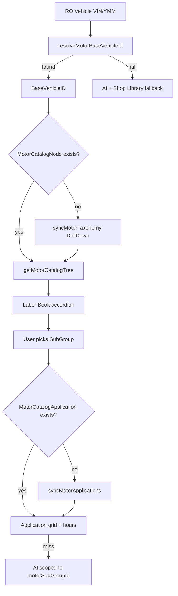

# MOTOR Taxonomy — Cross-Brand Coverage

**Date:** 2026-07-07  
**Workspace:** ShopRally (`C:\Users\tabis\OneDrive\Documents\ClaudeCode\ShopRally`)  
**Status:** Research / architecture guidance — no code changes  
**Related:** `docs/design/labor-catalog-reference-plan.md`, `docs/design/motor-taxonomy-ai-labor-integration.md`, `docs/SHOPRALLY-DEV.md`

---

## Executive answer

**MOTOR taxonomy works across brands — but only after you resolve a vehicle to a `BaseVehicleID` and sync (or fetch) taxonomy for that specific ID.** It is **not** one universal tree you can sync once and reuse for every car.

| Dimension | Verdict |
|-----------|---------|
| **Cross-brand (Ford, BMW, Honda, etc.)** | **Yes in production** — same API pattern, same MSOT-style System → Group → SubGroup shape, different `BaseVehicleID` per YMME/engine/trim. |
| **Per-vehicle vs global** | **Per `BaseVehicleID`** for API calls and ShopRally storage. Taxonomy **IDs/names** follow industry-standard MSOT; **which branches appear** is vehicle-config-dependent. |
| **ShopRally sync model** | **Correct** — `MotorCatalogNode` keyed by `baseVehicleId` + `nodeKey` (e.g. `22124\|s\|2\|g\|17\|sg\|44`). A single universal tree would be wrong. |
| **Sandbox** | API mirrors production, but data is a **small vehicle snapshot** — not full brand coverage. Use synced JSON fixtures (22124) for offline dev. |
| **Gaps** | No `BaseVehicleID`, pre-1985 classics, some EV/commercial edge cases, Canadian spec without `CO` — fall back to AI with clear labeling. |

**Bottom line for ShopRally:** Keep **sync per `BaseVehicleID`**, resolve VIN/YMM → `BaseVehicleID` first, lazy-sync on first Labor Book open, batch-warm top shop vehicles. Do **not** assume Honda Civic tree (22124) applies to a 2018 F-150 or Model 3.

---

## 1. How MOTOR scopes taxonomy

### API pattern (authoritative)

All EWT taxonomy requests are **scoped to a vehicle attribute in the URL path**:

```
GET /v1/Information/Vehicles/Attributes/BaseVehicleID/{BaseVehicleID}
    /Content/Taxonomies/Of/EstimatedWorkTimes
    ?ResultType=DrillDown
    &AttributeStandard=MOTOR
    [&SystemID=][&GroupID=][&SubGroupID=]
    [&EN=][&DT=][&SM=][&CO=][&BR=][&TR=]…
```

**Sources:** MOTOR DaaS Estimated Work Times API Reference v1.5; MOTOR Development Handbook 2025; [motor.com/get-estimated-work-times-taxonomy](https://www.motor.com/get-estimated-work-times-taxonomy/).

| Concept | Meaning |
|---------|---------|
| **`BaseVehicleID`** | MOTOR's primary vehicle key — encodes Year/Make/Model/Engine (YMME) in VCdb/MOTOR attribute standard. Unique per base vehicle configuration. |
| **`ResultType=DrillDown`** | Returns one taxonomy level at a time (System → Group → SubGroup), filterable by parent IDs. ShopRally chains these in `motor-taxonomy.ts`. |
| **VCdb filters (`EN`, `DT`, `SM`, `CO`, `BR`, …)** | Optional query params that **narrow** taxonomy and applications to a specific vehicle configuration (engine, drive type, submodel, country, brake type, etc.). |
| **Applications (hours)** | Same `BaseVehicleID` path on `…/Summaries/Of/EstimatedWorkTimes` — labor rows are **always per vehicle**, with position/qualifiers on the application row. |

### ShopRally implementation (verified)

```83:90:src/server/services/motor/motor-taxonomy.ts
  const res = await motorGet(
    `/Information/Vehicles/Attributes/BaseVehicleID/${baseVehicleId}/Content/Taxonomies/Of/EstimatedWorkTimes`,
    {
      ResultType: "DrillDown",
      AttributeStandard: "MOTOR",
      SystemID: filters.systemId,
      GroupID: filters.groupId,
      SubGroupID: filters.subGroupId,
    },
```

- `motorTaxonomyNodeKey()` prefixes every node with `baseVehicleId` — correct; IDs are not portable across vehicles without that prefix.
- `MotorCatalogNode` Prisma model: `@@unique([baseVehicleId, nodeKey])` — per-vehicle catalog rows.
- Sandbox fixture: `2010 Honda Civic` → `BaseVehicleID=22124`, VIN `19XFA1F51AE028415` (`motor-vehicle.ts`, `test-motor-api.ts`).
- Synced snapshot: `prisma/data/motor-taxonomy-22124.json` — 8 systems, 65 groups, 144 subgroups.

---

## 2. Core questions answered

### Q1 — Is MOTOR taxonomy global or per `BaseVehicleID`?

**Per `BaseVehicleID` for API access and browse trees.**

The taxonomy **naming standard** (MSOT — MOTOR Standard Operation Taxonomy) is **industry-wide**: public MOTOR examples show the same top-level systems across vehicles (Body & Frame, Brakes, Electrical, HVAC, Steering, Suspension, Powertrain, Vehicle). SystemID `2` = Brakes appears in MOTOR's public taxonomy response example.

However:

1. The **API requires** `{AttributeID}` = `BaseVehicleID` — there is no unscoped "get all taxonomy" endpoint.
2. **DrillDown results are filtered** by vehicle configuration; EVs drop ICE-only branches, trucks gain commercial groups, etc.
3. **Application rows** (actual billable operations + hours) are entirely per `BaseVehicleID`.

**Implication:** ShopRally must resolve the RO vehicle → `BaseVehicleID`, then load/sync **that** tree. Storing taxonomy globally without `baseVehicleId` would show wrong or empty branches for other vehicles.

### Q2 — Do System / Group / SubGroup names and IDs vary by vehicle?

**Mostly stable IDs and names; variable presence and depth.**

| Aspect | Behavior |
|--------|----------|
| **System names/IDs** | Highly stable (e.g. Brakes, Electrical). Same MSOT namespace across makes. |
| **Group / SubGroup names/IDs** | Same MSOT namespace; **subset** returned per vehicle — a Civic may not expose truck bed groups; a Tesla may emphasize HV/Electrical subgroups over engine R&R. |
| **"Same Brakes tree for all Hondas"** | **No** — same *vocabulary*, not identical *tree*. A 2010 Civic and 2020 Pilot share Brakes as a system but differ in groups/subgroups and application counts. Even two 2010 Civics with different engines get different `BaseVehicleID`s. |
| **Cross-brand "Brakes"** | Brakes SystemID/name is consistent; underlying Group/SubGroup IDs (e.g. Disc Brakes → Brake Pads) are MSOT-standard but **node population** differs by make/model/config. |

ShopRally's `nodeKey` design (`{baseVehicleId}|s|{systemId}|g|{groupId}|sg|{subGroupId}`) correctly treats taxonomy as **vehicle-scoped instances** of a shared ID scheme.

### Q3 — Different brands (Ford, BMW, Tesla, hybrid/EV)

| Brand / type | Production expectation | Taxonomy notes |
|--------------|------------------------|----------------|
| **Ford / Chevy / BMW / Honda / Toyota** | **Full EWT coverage** when `BaseVehicleID` resolves (1985+ U.S. light-duty per MOTOR product page). | Standard MSOT tree; qualifiers differ (Disc vs Drum, AWD, turbo, etc.). |
| **Tesla / BEV** | **Supported where MOTOR has YMME + EWT data** (same DaaS; VIN/YMME lookup). | Tree **shape** shifts: fewer Powertrain ICE subgroups; more Electrical/HV/Battery content. Do not expect "Engine R&R" subgroups. |
| **Hybrid (PHEV/HEV)** | **Supported** — often separate `BaseVehicleID` per hybrid trim/engine. | Both ICE and HV subgroups may appear; `EN` (engine) filter matters. |
| **Medium / heavy-duty** | **Separate license tier** (Class 1–8; VMRS mapping for M/H duty per MOTOR EWT product page). | May use truck-specific make tables (`FORD_TRUCKS`, etc. in Gen 4.5 CDK). Confirm shop's MOTOR contract includes M/H duty. |
| **Exotic / low volume** | **Variable** — resolves if in VCdb/MOTOR; may be sparse. | Fewer application rows; more AI fallback. |

**Vehicle resolution path in ShopRally:** VIN search (`/Search/ByVIN`) → 10-char prefix → YMM term search (`motor-vehicle.ts`). If resolution fails, taxonomy sync cannot proceed — show AI fallback, not a wrong tree.

### Q4 — Sandbox vs production coverage

| | **Sandbox** | **Production** |
|---|-------------|------------------|
| **API host / auth** | Same DaaS API surface; shared public key pair at [motor.com/daas-sandbox](https://www.motor.com/daas-sandbox/) | Partner-issued `MOTOR_PUBLIC_KEY` + `MOTOR_PRIVATE_KEY` |
| **Vehicle data** | **Snapshot only** — MOTOR describes it as "a couple vehicles" (public page). Partner `Sandbox_Info_2025.pdf` (referenced in `SHOPRALLY-DEV.md`) may enumerate more test VINs (~15 in internal onboarding docs — **not** full YMME catalog). | Full licensed YMME universe for contracted products (light / medium-heavy duty, regions). |
| **Cross-brand testing** | **Cannot validate all brands in sandbox.** ShopRally has fully synced **22124** (2010 Honda Civic) locally — use `prisma/data/motor-taxonomy-22124.json` + `SANDBOX_VIN_BASE_VEHICLE_ID` map for offline UI. | Resolve any in-coverage vehicle live. |
| **Redistribution** | Dev/prototype only — **no** customer-facing licensed hours from sandbox data. | Commercial license required to persist/display taxonomy + hours. |
| **Rate limits** | Apply (Handbook) — DrillDown is multi-request per vehicle (ShopRally: 1 + per-system + per-group). | Same; plan lazy sync + caching. |

**Can we only test 15 vehicles?** In sandbox, **yes effectively** — only snapshot vehicles return real data. In production, **no** — any vehicle with EWT coverage works once licensed. ShopRally should not infer Ford/BMW behavior from 22124 alone; use production keys or MOTOR's interactive API docs for spot checks.

### Q5 — ShopRally architecture: per `BaseVehicleID` vs universal tree

| Approach | Verdict |
|----------|---------|
| **Sync per `BaseVehicleID` (current)** | **Correct** — matches API, Prisma schema, and competitor CRM pattern (Tekmetric/AutoLeap load MOTOR per vehicle). |
| **One universal tree** | **Wrong** — API does not offer it; branches and applications are vehicle-specific; would mis-route browse and AI context. |
| **Global taxonomy tables (M1 in older plan)** | **Superseded** — `labor-catalog-reference-plan.md` M1 mentioned global `CatalogSystem/Group/SubGroup`; **implemented** design uses `MotorCatalogNode` per `baseVehicleId`, which matches MOTOR's vehicle-scoped DrillDown. |

**Recommended sync strategy:**

1. **Resolve first** — `resolveMotorBaseVehicleId(vehicle)` on Labor Book / Quick Labor open (VIN preferred, YMM+engine fallback).
2. **Sync-on-first-open (lazy)** — If no `MotorCatalogNode` rows for `baseVehicleId`, run `syncMotorTaxonomyForVehicle({ baseVehicleId, persist: true })`; then SubGroup-scoped `syncMotorApplications` for opened branch or top subgroups.
3. **YMM-primary cache** — Keep `LaborOperation.vehicleKey` as `ymm:…` (existing `labor-vehicle-key.ts`); catalog FKs reference `baseVehicleId` + `motorApplicationId`.
4. **Batch warm top vehicles** — Nightly/weekly job: shop's top N `BaseVehicleID`s from RO history (e.g. 50–200) to reduce first-open latency.
5. **Fallback chain** — No `BaseVehicleID` → custom shop library + AI; empty SubGroup applications → AI scoped to `motorSubGroupId` (see `motor-taxonomy-ai-labor-integration.md`).
6. **Do not copy 22124 tree** to other vehicles — `MOTOR_REFERENCE_BASE_VEHICLE_ID` in static shop library is a **dev reference** only.

### Q6 — Edge cases

| Edge case | Expected behavior | ShopRally handling |
|-----------|-------------------|-------------------|
| **No MOTOR coverage** | VIN/YMM search returns no `BaseVehicleID`, or taxonomy/apps empty. Common for very old, obscure, or non-U.S. configs without proper `CO`. | `resolveMotorBaseVehicleId` → `null`; no sandbox map → AI + shop library; banner "MOTOR catalog unavailable for this vehicle." |
| **Commercial trucks (Class 4–8)** | Covered under **medium/heavy-duty EWT** product (separate license). Gen 4.5 uses make-specific truck tables. | Confirm platform MOTOR contract; resolve truck `BaseVehicleID`; expect different group density (VMRS-aligned). |
| **Classic cars (pre-1985)** | Gen 4.5 CDK: "1984 and up"; MOTOR marketing: **1985+** U.S. light-duty. Pre-1985 sparse or absent. | AI fallback; optional Mitchell/ALLDATA integration later (different taxonomy). |
| **Canadian spec** | YMME supports `CO` (Country ID); VIN-to-VCDB Canada product exists. Applications may differ from U.S. same YMM. | Pass `CO` when shop region = CA; resolve Canadian `BaseVehicleID`; do not assume U.S. 22124-equivalent tree. |
| **Wrong YMM / missing engine** | Resolves to incorrect `BaseVehicleID` → wrong taxonomy branch (e.g. wrong brake type). | Prefer VIN; prompt for engine/submodel when YMM ambiguous; use VCdb filters (`EN`, `SM`) on summaries. |
| **Submodel / Country required** | Handbook error `400.110073` / `400.110074`: Submodel ID or Country ID required when specifying base vehicle ID in some contexts. | Ensure vehicle picker captures trim/submodel; set `CO` for regional shops. |

---

## 3. Brand examples — expected behavior

| Example vehicle | `BaseVehicleID` | Taxonomy expectation | ShopRally test status |
|-----------------|-----------------|----------------------|------------------------|
| **2010 Honda Civic** (sandbox VIN `19XFA1F51AE028415`) | **22124** | 8 systems / 65 groups / 144 subgroups; Brakes → Disc Brakes → Brake Pads, etc. | **Synced** — `motor-taxonomy-22124.json`, DB `MotorCatalogNode`, apps sync scripts |
| **2014 Honda Accord EX-L** (Tekmetric parity RO) | Resolve via VIN/YMM (not 22124) | Same MSOT system names; different group/subgroup counts; more features (V6, etc.) | Production keys only; sandbox may not resolve |
| **2018 Ford F-150 3.5L** | Truck `BaseVehicleID` (M/H duty tables if applicable) | Brakes/Suspension/Steering + truck-specific groups (towing, bed, etc.) | Sandbox unlikely; prod license |
| **2014 BMW 640i** (AutoLeap ref) | BMW-specific ID | European luxury configs; more Electrical/HVAC depth | Sandbox unlikely |
| **Tesla Model 3** | BEV `BaseVehicleID` | Electrical/HV heavy; minimal engine Powertrain | Coverage depends on MOTOR YMME entry; prod |
| **2010 Prius (hybrid)** | Hybrid-specific ID | Both ICE maintenance + HV battery/cooling subgroups | Prod |
| **Freightliner / Class 8** | M/H duty ID | VMRS-mapped operations; different density | Requires M/H MOTOR license |
| **1969 Camaro** | Likely **none** | Pre-coverage | AI fallback only |
| **Canadian 2015 Civic** | CA `BaseVehicleID` (`CO` filter) | May differ from U.S. 22124 sibling | Pass `CO`; prod |

---

## 4. Architecture diagram



---

## 5. Sandbox vs production — practical checklist

| Task | Sandbox | Production |
|------|---------|------------|
| Validate DrillDown code path | ✅ 22124 | ✅ Any covered vehicle |
| Validate cross-brand Ford/BMW/Tesla | ❌ Use prod keys or MOTOR interactive docs | ✅ |
| Persist taxonomy in customer UI | ❌ License + prod data | ✅ With MOTOR contract |
| Offline dev without API | ✅ `motor-taxonomy-22124.json` + static adapter | N/A |
| Load-test sync throughput | ⚠️ Limited vehicles; respect rate limits | ✅ Batch top BaseVehicleIDs |

---

## 6. Corrections to earlier design notes

`labor-catalog-reference-plan.md` states:

> *Taxonomy is global and licensed. Applications are per BaseVehicleID.*

**Refined interpretation for implementers:**

- **Licensed content** is global in the sense that MOTOR owns one MSOT namespace (not per-shop).
- **API and storage** are **per `BaseVehicleID`** — ShopRally's `MotorCatalogNode` implementation is the correct interpretation.
- **Applications and hours** are always per `BaseVehicleID`.
- **Do not** build a single shared tree table without `baseVehicleId` and copy 22124 to all vehicles.

---

## 7. References

| Source | URL / path |
|--------|------------|
| ShopRally MOTOR taxonomy service | `src/server/services/motor/motor-taxonomy.ts` |
| ShopRally vehicle resolution | `src/server/services/motor/motor-vehicle.ts` |
| Smoke test | `scripts/test-motor-api.ts` → `npm run test:motor` |
| Sync CLI | `scripts/sync-motor-taxonomy.ts` → `npm run sync:motor-taxonomy` |
| Synced fixture | `prisma/data/motor-taxonomy-22124.json` |
| Catalog architecture plan | `docs/design/labor-catalog-reference-plan.md` |
| AI integration plan | `docs/design/motor-taxonomy-ai-labor-integration.md` |
| Dev env | `docs/SHOPRALLY-DEV.md` |
| MOTOR DaaS Sandbox | https://www.motor.com/daas-sandbox/ |
| MOTOR EWT product (coverage) | https://www.motor.com/products-services/data-products/estimated-work-times/ |
| MOTOR EWT API Reference v1.5 | https://www.motor.com/wp-content/uploads/2015/09/daas-estimated-work-times-api-reference.pdf |
| MOTOR DaaS Development Handbook 2025 | https://www.motor.com/wp-content/uploads/2025/08/MOTOR_-DaaS_Data_as_a_Service_Development_Handbook.pdf |
| MOTOR Vehicle ID API Reference | https://www.motor.com/wp-content/uploads/2015/09/daas-vehicle-identification-and-premium-options-api-reference.pdf |

---

## 8. Key caveat (read this first)

**The Honda Civic sandbox tree (`BaseVehicleID` 22124) proves the integration pattern — it does not prove that every brand shares that exact tree.** MSOT gives you consistent *vocabulary* (Brakes, Electrical, …); each vehicle gets its own *instance* of the tree and its own application rows. Production works across brands **when** you resolve the correct `BaseVehicleID` and sync per vehicle; sandbox only lets you **test** that pattern on a handful of snapshot vehicles.
