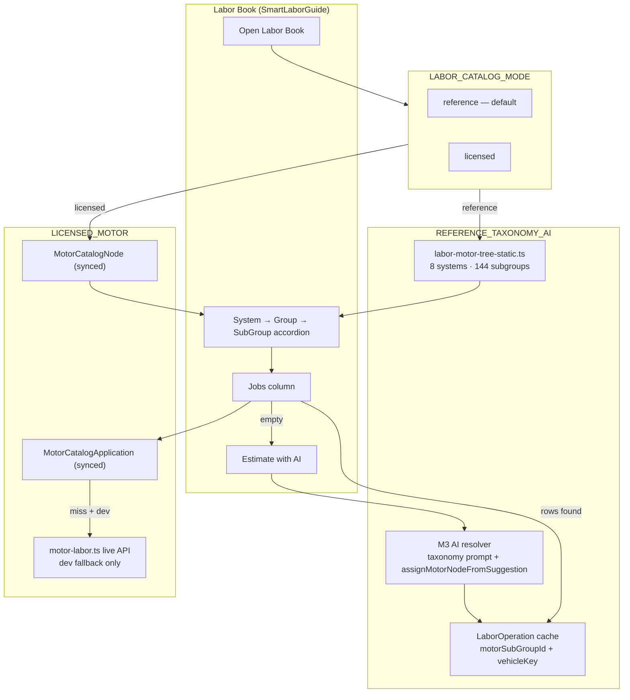

# Taxonomy Scaffold + AI Gap Fill — Production Path Without MOTOR License

**Date:** 2026-07-07  
**Workspace:** ShopRally  
**Status:** Implemented (reference mode default)  
**Related:** `motor-taxonomy-ai-labor-integration.md`, `labor-catalog-reference-plan.md`, `ai-labor-guide-datasets-and-competitors.md`

---

## Executive summary

ShopRally can ship a **Tekmetric-class Labor Book browse experience** without a MOTOR DaaS subscription by using the **industry reference taxonomy** (System → Group → SubGroup structure captured once from sandbox sync) as a **browse scaffold**, and filling **missing application rows and hours** with **AI estimates** scoped to the selected SubGroup.

Licensed MOTOR mode remains available when `LABOR_CATALOG_MODE=licensed` and API keys are configured.

---

## Architecture



---

## Operating modes

| Mode | Env | Tree source | Jobs column | Hours source | UI label |
|------|-----|-------------|-------------|--------------|----------|
| **REFERENCE_TAXONOMY_AI** | `LABOR_CATALOG_MODE=reference` (default) | `MOTOR_LABOR_SYSTEMS` static file | `LaborOperation` by `motorSubGroupId` | AI (`ai_taxonomy_scoped`) or prior cache | **Industry taxonomy (reference)** · **Reference taxonomy · AI hours** |
| **LICENSED_MOTOR** | `LABOR_CATALOG_MODE=licensed` + MOTOR keys | `MotorCatalogNode` per `baseVehicleId` | `MotorCatalogApplication` | Licensed EWT (`motor_ewt`) | **MOTOR Catalog** |
| **Dev sandbox overlay** | `NODE_ENV=development` + reference mode | Static (same) | May also read sandbox-synced `MotorCatalogApplication` | `motor_ewt` from DB sync scripts | Same reference labels; rows badge **MOTOR EWT** |

### Env vars

```bash
# Default production path — no MOTOR license
LABOR_CATALOG_MODE=reference

# Licensed path (requires MOTOR keys)
LABOR_CATALOG_MODE=licensed
MOTOR_ENABLED=true
MOTOR_PUBLIC_KEY=...
MOTOR_PRIVATE_KEY=...

# Shorthand: opt into licensed when keys present
MOTOR_LICENSED=true
```

Implementation: `src/lib/labor-catalog-mode.ts`

---

## Data source labeling

| `dataSource` | Meaning | When |
|--------------|---------|------|
| `motor_ewt` | Licensed MOTOR Estimated Work Times | Licensed mode or dev sandbox DB rows |
| `ai_taxonomy_scoped` | AI estimate scoped to reference SubGroup IDs | Reference mode AI generate |
| `ai_motor_scoped` | AI estimate scoped to synced MOTOR taxonomy nodes | Licensed mode, DB taxonomy present |
| `ai_first_principles` | AI estimate without taxonomy scope | Free-text search generate |

UI badges: `src/lib/labor-guide-helpers.ts` → `dataSourceBadgeLabel()`

---

## What comes from where

### Static reference tree (`labor-motor-tree-static.ts`)

- Generated once from `prisma/data/motor-taxonomy-22124.json` (Civic sandbox snapshot).
- **8 systems, 144 subgroups** — structure and display names only.
- Used for browse accordion in reference mode; **no live API**, **no MotorCatalogNode required**.
- Legal guardrail: single reference snapshot in repo; do not bulk-redistribute MOTOR content or re-sync names to prod at scale without license.

### AI gap fill (M3 path)

When Jobs column is empty for a SubGroup:

1. User clicks **Estimate with AI** (pre-fills e.g. `Brake Pads R&R`).
2. `lookupLaborSuggestion` → `resolveLaborSuggestionWithFallback` with `motorSubGroupId`.
3. `buildMotorTaxonomyPromptBlock` uses static tree in reference mode.
4. `assignMotorNodeFromSuggestion` assigns `motorSubGroupId=44` etc. with `dataSource: ai_taxonomy_scoped`.
5. Row persisted to `LaborOperation` with motor IDs for future cache hits.

### Shop cache (`LaborOperation`)

- Keyed by `vehicleKey` + `queryKey` (legacy) and `motorSubGroupId` (taxonomy-aligned).
- Reference mode Jobs column queries: `motorSubGroupId` + vehicle keys.
- Prior AI or shop-seeded rows appear without re-calling Anthropic.

### Licensed MOTOR (dev / future prod with license)

- `scripts/sync-motor-taxonomy.ts` → `MotorCatalogNode`
- `scripts/sync-motor-applications.ts` → `MotorCatalogApplication`
- Live API guarded in `motor-labor.ts` — returns empty unless `isLicensedMotorCatalog()`.

---

## Migration from MOTOR-dependent UI labels

| Before | After (reference mode) |
|--------|------------------------|
| "MOTOR Catalog" header | "Industry taxonomy (reference)" |
| "MOTOR reference taxonomy" badge | "Reference taxonomy · AI hours" |
| `motorSource === "motor"` only for taxonomy browse | `catalogMode === "reference"` always shows static tree |
| `ai_motor_scoped` on AI rows | `ai_taxonomy_scoped` in reference mode |
| `loadShopBrowseForMotorSubGroup` keyword browse fallback | Direct `motorSubGroupId` cache query + AI |

---

## Legal / practical guardrails

1. **Sandbox-synced taxonomy in DB** — OK for **dev** prototyping (`npm run sync:motor-*`).
2. **Production without license** — use **static reference tree** only; do not serve live MOTOR API responses or bulk literalNames to end users.
3. **AI job names + hours** — first-principles generation; do not copy MOTOR `literalName` strings in bulk into prompts or training data.
4. **Display layer** — reference mode uses "Industry taxonomy (reference)" not "MOTOR catalog".
5. **Upgrade path** — set `LABOR_CATALOG_MODE=licensed`, sync taxonomy + applications per vehicle, UI automatically switches to licensed labels and `motor_ewt` rows.

---

## File map

| File | Role |
|------|------|
| `src/lib/labor-catalog-mode.ts` | Feature flag + display labels |
| `src/lib/labor-book-reference.ts` | Static tree lookup, cache → grid rows |
| `src/lib/labor-motor-tree-static.ts` | Reference taxonomy snapshot |
| `src/server/actions/labor-book-motor.ts` | Init + SubGroup jobs (reference vs licensed) |
| `src/server/services/motor/motor-node-assignment.ts` | `ai_taxonomy_scoped` from static IDs |
| `src/server/services/motor/motor-ai-context.ts` | Taxonomy prompt + RAG guards |
| `src/server/services/motor/motor-labor.ts` | Live API kill switch |
| `src/server/labor-guide-cache.ts` | Lookup ladder respects mode |
| `src/components/repair-order/smart-labor-guide.tsx` | Reference browse UI |
| `scripts/seed-reference-taxonomy-labels.ts` | Export static tree JSON for docs |

---

## Test plan (Civic RO)

1. Set `LABOR_CATALOG_MODE=reference` in `.env`.
2. Open Civic RO → Labor Book.
3. Verify header: **Industry taxonomy (reference)** · badge **Reference taxonomy · AI hours**.
4. Browse **Brakes → Disc Brakes → Brake Pads** (`motorSubGroupId=44`).
5. Jobs column empty → click **Estimate with AI**.
6. Confirm row with `motorSubGroupId=44`, `dataSource=ai_taxonomy_scoped`, badge **AI · taxonomy scoped**.
7. Re-open same SubGroup — row served from `LaborOperation` cache.

---

## Dev vs production

| Concern | Dev (`NODE_ENV=development`) | Production (`LABOR_CATALOG_MODE=reference`) |
|---------|-------------------------------|---------------------------------------------|
| Sync scripts | `sync-motor-taxonomy`, `sync-motor-applications` OK | Not required; static tree only |
| `MotorCatalogApplication` in Jobs column | Allowed as sandbox overlay (`allowSandboxMotorDbCache`) | Disabled — cache + AI only |
| Live MOTOR API | Blocked unless `licensed` | Blocked |
| Taxonomy tree in UI | Static reference (same as prod) | Static reference |
| AI RAG from MOTOR apps | Allowed in dev sandbox | Skipped — `LaborOperation` RAG only |
