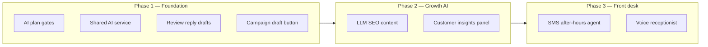

# Premier AI Roadmap

Owner-built, quality-first plan to deliver what marketing promises on **Premier** (`ShopPlan.ENTERPRISE`).  
Update this file at the end of each work session (checkboxes + progress log).

**Last updated:** 2026-06-28  
**Overall progress:** Phase 1 ✅ · Phase 2 ✅ · Phase 3 ✅

---

## Principles (how we build “correctly”)

1. **Human-in-the-loop** — AI never publishes or sends without explicit user action.
2. **Plan gates on server + UI** — `canUseFeature()` in actions; disabled states + upgrade copy in UI.
3. **Graceful degradation** — If `ANTHROPIC_API_KEY` is missing, fall back to templates/rules; never hard-crash cron jobs.
4. **Shop context in every prompt** — Name, city, tone; no invented visit details.
5. **Audit-friendly** — Log model + feature + shopId for platform ops (Phase 1 cleanup).
6. **One shared AI layer** — Single client, model routing, token limits (Phase 1 cleanup).

---

## Roadmap (phases)



| Phase | Goal | Premier marketing claim |
|-------|------|-------------------------|
| **1** | Ship gated AI in existing surfaces | AI review replies · AI campaign drafting |
| **2** | Replace rule-based / missing AI | AI SEO Autopilot · AI customer insights |
| **3** | Telephony product | AI receptionist |

---

## Phase 1 — Foundation

### A. AI plan gates

| Task | Status | Notes |
|------|--------|-------|
| `aiReviewReplies` on Premier only | ✅ Done | `src/lib/plans.ts` |
| `aiCampaignDrafting` on Premier only | ✅ Done | `src/lib/plans.ts` |
| `canUseFeature` mapping | ✅ Done | `src/lib/subscription.ts` |
| Subscription panel shows AI flags | ✅ Done | `subscription-panel.tsx` |
| `aiSeoContent` plan flag (Premier) | ✅ Done | Phase 2E |
| `aiCustomerInsights` plan flag (Premier) | ✅ Done | Phase 2F |
| `aiReceptionist` plan flag (Premier) | ✅ Done | Phase 3G SMS + 3H voice |
| Platform admin override via `planFeatures` JSON | ✅ Works | `resolvePlanFeatures()` |
| Billing comparison rows match gates | ✅ Done | `plans.ts` comparison table |

### B. Shared AI service

| Task | Status | Notes |
|------|--------|-------|
| Review reply service | ✅ Done | `src/server/services/ai/review-reply.ts` |
| Campaign draft service | ✅ Done | `src/server/services/ai/campaign-draft.ts` |
| Unified `src/server/services/ai/client.ts` | ✅ Done | Anthropic client, model map, `isAiConfigured()` |
| Per-feature model env vars documented | ✅ Done | See Environment variables below |
| `AiUsageLog` (shopId, feature, model, tokens) | ✅ Done | Prisma + write on each `createAiMessage` call |
| Rate limit per shop (daily cap) | ✅ Done | `assertShopAiRateLimit()` — default 200/shop/day UTC |
| Platform `/platform` usage summary | ✅ Done | `getPlatformAiUsageSummary()` + `platform-home.tsx` |

### C. Review reply drafts

| Task | Status | Notes |
|------|--------|-------|
| `draftGoogleReviewReply` action | ✅ Done | `google-reviews.ts` |
| Inbox UI — Draft with AI | ✅ Done | `google-reviews-inbox.tsx` |
| Premier gate + billing link | ✅ Done | |
| Edit-before-post disclaimer | ✅ Done | |
| Low-star phone append | ✅ Done | When shop has phone |
| Tone settings (friendly/formal) | ✅ Done | Reviews inbox — shop `aiReviewReplyTone` |
| Regenerate / shorter / longer variants | ✅ Done | Shorter/Longer on review draft editor |

### D. Campaign draft button

| Task | Status | Notes |
|------|--------|-------|
| `draftCampaignMessage` action | ✅ Done | `campaigns.ts` |
| Wizard Message step — Generate with AI | ✅ Done | `campaign-wizard.tsx` |
| Merge token preservation | ✅ Done | Prompt instructs `{customer_name}` etc. |
| SMS length hint | ✅ Done | Char count + warning >320 |
| Email subject for EMAIL/BOTH | ✅ Done | |
| Regenerate from current draft | ✅ Done | Passes `currentMessage` |
| Campaign **edit** flow (existing campaign) | ✅ Done | Detail page — edit + AI draft for DRAFT/SCHEDULED/PAUSED |

**Phase 1 exit criteria:** All ✅ above except optional items; shared client + usage log complete before Phase 2 ships to production.

---

## Phase 2 — Growth AI

### E. LLM SEO content

**Problem:** `runShopSeoContentGeneration()` is rule-based (canned jobs + keywords). Marketing says “AI SEO Autopilot.”

**Target behavior:**

- When `ShopSeoSettings.contentAutopilotEnabled` **and** shop has `aiSeoContent` (Premier):
  - LLM generates/refines: meta title, meta description, up to N service blurbs, keyword suggestions.
- When API key missing or LLM fails: **existing rule-based path** (no regression).
- Cron + Inngest paths unchanged; only the enrichment step gains LLM.

| # | Task | Status | Files / area |
|---|------|--------|----------------|
| E1 | Add `aiSeoContent` plan feature (Premier) | ✅ Done | `plans.ts`, `subscription.ts` |
| E2 | `suggestSeoContent()` AI service | ✅ Done | `src/server/services/ai/seo-content.ts` |
| E3 | Integrate into `runShopSeoContentGeneration` | ✅ Done | `seo-content-generation.ts` |
| E4 | `ShopSeoSettings.useAiContent` toggle (default true on Premier) | ✅ Done | Prisma + `seo-settings` |
| E5 | SEO Autopilot hub — show AI vs template mode | ✅ Done | `seo-automation-hub.tsx` |
| E6 | Manual “Run AI content now” respects gate | ✅ Done | `seo-automation.ts` actions |
| E7 | Job run log records `ai` vs `template` source | ✅ Done | `SeoAutomationRun` summary JSON |
| E8 | Disclaimers in Website SEO editor | ✅ Done | “Review before publish” |
| E9 | Tests: mock LLM, fallback when key missing | ✅ Done | `scripts/test-seo-content-parse.ts` |
| E10 | Update `docs/website-seo-service.md` | ✅ Done | |

**E exit criteria:**

- [x] Premier shop with autopilot on gets LLM-enriched microsite copy on bi-weekly job.
- [x] Starter/Pro never call LLM for SEO content.
- [x] Job succeeds with template fallback if Anthropic errors.
- [x] Owner can disable AI content per shop without disabling autopilot entirely.

---

### F. Customer insights panel

**Target behavior:**

- Premier-gated **Insights** panel on customer detail (`/customers/[id]`).
- Server aggregates: last visit, RO count, open/declined inspection items, avg ticket, campaign touches.
- One structured LLM call → bullet insights + suggested next action (book, call, win-back).
- Refresh button; cache 24h per customer to limit cost.
- No auto-send; advisor reads and acts.

| # | Task | Status | Files / area |
|---|------|--------|----------------|
| F1 | Add `aiCustomerInsights` plan feature (Premier) | ✅ Done | `plans.ts`, `subscription.ts` |
| F2 | `getCustomerInsightContext()` query layer | ✅ Done | `src/server/customer-insights.ts` |
| F3 | `suggestCustomerInsights()` AI service (JSON schema) | ✅ Done | `src/server/services/ai/customer-insights.ts` |
| F4 | `getCustomerInsights` / `refreshCustomerInsights` actions | ✅ Done | `src/server/actions/customer-insights.ts` |
| F5 | `CustomerInsightsPanel` UI | ✅ Done | `customer-detail-view.tsx` |
| F6 | Cache table or `Customer.insightsCache` JSON + TTL | ✅ Done | `Customer.aiInsightsCache` + 24h TTL |
| F7 | Empty states (new customer, no ROs) | ✅ Done | |
| F8 | Upgrade CTA for non-Premier | ✅ Done | |
| F9 | Platform usage log feature tag | ✅ Done | `CUSTOMER_INSIGHTS` via shared client |
| F10 | Optional v2: dashboard “shops to call” batch | ⬜ Defer | |

**F exit criteria:**

- [x] Premier user sees insights on customer with ≥1 RO.
- [x] Pro user sees upgrade card, no API call.
- [x] Insights cite only data present in context (no hallucinated ROs).
- [x] Refresh works; cache prevents hammering API.

**Phase 2 exit criteria:** E + F exit criteria met; Phase 1 B (shared client + usage log) complete.

---

## Phase 3 — Front desk (later)

| Track | Scope | Depends on |
|-------|--------|------------|
| **G — SMS after-hours agent** | Twilio inbound SMS → LLM → booking/intake API | Messaging infra ✅ |
| **H — Voice receptionist** | Twilio Voice or Vapi, recording consent, call log UI | G learnings |

### G. SMS after-hours agent

| # | Task | Status | Notes |
|---|------|--------|-------|
| G1 | `aiReceptionist` plan feature (Premier) | ✅ Done | `plans.ts`, `subscription.ts` |
| G2 | `Shop.aiSmsAgentEnabled` + settings UI | ✅ Done | Phone & SMS wizard step 4 |
| G3 | After-hours detection (shop TZ + booking hours) | ✅ Done | `lib/shop-hours.ts` |
| G4 | `suggestSmsAgentReply()` LLM service | ✅ Done | `services/ai/sms-agent.ts` |
| G5 | Twilio webhook → agent → TwiML reply | ✅ Done | `/api/webhooks/twilio/sms` |
| G6 | Session state + appointment create | ✅ Done | `AiSmsAgentSession`, source `SMS_AGENT` |
| G7 | Unknown caller → CRM lead customer | ✅ Done | Creates customer on first text |
| G8 | Usage log `SMS_AFTER_HOURS` | ✅ Done | Shared AI client |
| G9 | Dev override `AI_SMS_AGENT_ALWAYS_ON` | ✅ Done | Non-production only |

### H. Voice receptionist

| # | Task | Status | Notes |
|---|------|--------|-------|
| H1 | `Shop.aiVoiceAgentEnabled` + settings UI | ✅ Done | Phone & SMS wizard step 4 |
| H2 | `VoiceCallLog` + call log UI | ✅ Done | `voice-call-log-panel.tsx` |
| H3 | `/api/webhooks/twilio/voice` + after-hours gate | ✅ Done | Forwards to landline when open |
| H4 | Gather loop + `suggestVoiceAgentReply()` | ✅ Done | `/voice/gather`, speech TwiML |
| H5 | `AiVoiceAgentSession` | ✅ Done | Keyed by CallSid |
| H6 | Appointment `source: "VOICE_AGENT"` | ✅ Done | Shared `receptionist-booking.ts` |
| H7 | Recording consent + status callback | ✅ Done | `/voice/recording` |
| H8 | `VOICE_RECEPTIONIST` usage + VoiceUrl on provision | ✅ Done | `purchaseAndConfigureNumber` |

**H exit criteria:**

- [x] Premier shop with voice agent enabled gets AI call handling when closed.
- [x] During open hours, calls forward to landline when configured.
- [x] Completed intake creates `Appointment` with source `VOICE_AGENT`.
- [x] Call log shows status, duration, recording link when available.

**G exit criteria:**

- [x] Premier shop with agent enabled gets AI SMS replies when closed.
- [x] During open hours, normal inbound SMS (no agent).
- [x] Completed intake creates `Appointment` with source `SMS_AGENT`.
- [x] Pro/Starter cannot enable agent (server gate).

---

## Environment variables

| Variable | Purpose | Default |
|----------|---------|---------|
| `ANTHROPIC_API_KEY` | Required for any AI feature | — |
| `REVIEW_REPLY_AI_MODEL` | Review drafts | `claude-haiku-4-5` |
| `CAMPAIGN_AI_MODEL` | Campaign drafts | Haiku |
| `SEO_CONTENT_AI_MODEL` | Phase 2E | Haiku (planned) |
| `CUSTOMER_INSIGHTS_AI_MODEL` | Phase 2F customer insights | Haiku |
| `AI_DAILY_LIMIT_PER_SHOP` | Per-shop daily AI call cap | `200` |
| `AI_DEFAULT_MODEL` | Fallback model for all features | `claude-haiku-4-5` |
| `SUPPORT_AI_MODEL` | Support FAQ + fallback | Haiku |
| `SMS_AGENT_AI_MODEL` | Phase 3G after-hours SMS | Haiku |
| `VOICE_AGENT_AI_MODEL` | Phase 3H voice receptionist | Haiku |
| `AI_SMS_AGENT_ALWAYS_ON` | Dev: SMS agent even when shop is open | unset |
| `AI_VOICE_AGENT_ALWAYS_ON` | Dev: voice agent even when shop is open | unset |
| `LABOR_GUIDE_MODEL` | Smart labor (Pro+, separate) | Sonnet |

---

## Key file map

```
src/lib/plans.ts                          — Plan features + marketing comparison
src/lib/subscription.ts                   — canUseFeature()
src/server/services/ai/
  review-reply.ts                         — ✅ Phase 1C
  campaign-draft.ts                       — ✅ Phase 1D
  client.ts                               — ✅ Phase 1B
  seo-content.ts                          — ✅ Phase 2E
  customer-insights.ts                    — ✅ Phase 2F
  sms-agent.ts                            — ✅ Phase 3G
  voice-agent.ts                          — ✅ Phase 3H
src/server/services/sms-after-hours-agent.ts — Phase 3G orchestration
src/server/services/voice-after-hours-agent.ts — Phase 3H orchestration
src/server/services/receptionist-booking.ts    — Shared appointment intake
src/app/api/webhooks/twilio/voice/        — Inbound + gather + recording
src/components/settings/voice-call-log-panel.tsx
src/server/services/seo-content-generation.ts — Rule-based today → LLM in 2E
src/components/marketing/google-reviews/  — Review inbox
src/components/marketing/campaigns/         — Campaign wizard
src/components/customers/customer-detail-view.tsx — Insights UI (2F)
```

---

## Suggested build order (owner, quality-first)

1. **Marketing alignment** — spot-check public pricing vs live gates after launches.

---

## Progress log

| Date | Session focus | Completed | Next |
|------|---------------|-----------|------|
| 2026-06-28 | Phase 1C/D | Review AI drafts, campaign AI drafts, plan gates | Phase 1B shared client |
| 2026-06-28 | Phase 3G | SMS after-hours AI agent, Twilio TwiML, booking intake | Phase 3H voice |
| 2026-06-28 | Phase 3H | Voice receptionist, call log, recording consent | Phase 1 leftovers |
| 2026-06-28 | Phase 1D | Campaign detail edit + AI regenerate | Review tone settings |
| 2026-06-28 | Phase 1C | Review tone + shorter/longer AI variants | Ops / marketing alignment |
| 2026-06-28 | Ops | Twilio SMS+Voice webhook sync for existing numbers | — |

---

## Session checklist (copy each time you work)

```
[ ] Read docs/premier-ai-roadmap.md — pick next ⬜ task
[ ] Implement server gate + UI gate together
[ ] Fallback when ANTHROPIC_API_KEY missing
[ ] npx tsc --noEmit
[ ] Manual test on Premier shop + Pro shop (gate)
[ ] Update checkboxes + progress log in this file
[ ] Optional: CLAUDE.md status line
```

---

## Marketing alignment checklist

Before calling Phase 2 “done” publicly:

- [x] Premier pricing page claims match enforced gates (comparison table + Premier AI section).
- [x] Professional = review **management** (manual), not AI drafts — stated on pricing page.
- [x] SEO Autopilot copy says “AI-assisted” only where LLM runs — gated on Premier in product.
- [x] No “AI voice receptionist” until Phase 3 H ships — **now live on Premier** (enable in Phone & SMS settings).
