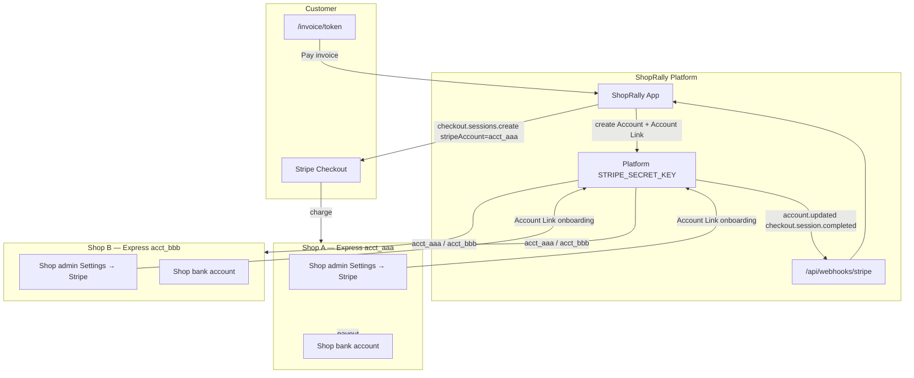

# Stripe Connect — platform + shop-level payments

Design for Tekmetric-class multi-tenant payments in ShopRally.  
**Status:** Scaffold built (schema + services + settings UI). Live Connect requires a Stripe **platform** account with Connect enabled.

See also: `docs/stripe-payments.md` (MVP test guide for invoice Checkout).

---

## Industry pattern (Tekmetric, Shopmonkey, etc.)

| Layer | Who | Role |
|-------|-----|------|
| **Platform** | ShopRally (parent SaaS) | Stripe **Connect platform** account. Creates Express connected accounts, hosts onboarding, routes Checkout with `stripeAccount`, receives webhooks, optional application fees / SaaS billing. |
| **Shop** | Each auto repair location | Own **Stripe Express** connected account. Shop admin completes KYC + bank. **Customer payments settle to the shop.** |
| **Customer** | Vehicle owner | Pays invoice link, text-to-pay, tire deposit, or booking deposit. Sees shop name on Checkout; never sees ShopRally platform keys. |

### How peers do it

- **Tekmetric** — [Stripe case study](https://stripe.com/customers/tekmetric): Stripe Connect + Payments + Terminal + Optimized Checkout (Payment Element, Payment Links, BNPL). Shops onboard via Connect; funds flow shop → Tekmetric can take platform fees. Moving to Connect embedded components.
- **Shopmonkey** — Same Connect Express pattern; embedded onboarding in-app; Stripe Billing for shop subscriptions; Capital for shop financing.

ShopRally target: **Express + Account Links (redirect)** for v1, same money flow as Tekmetric. Embedded onboarding + Terminal deferred.

---

## Architecture



**Charge type:** Direct charges on connected account (`stripeAccount` header) — money lands in shop account; platform can add `application_fee_amount` later.

**Platform subscription billing** (ShopRally → shop monthly fee) is **separate** — use Stripe Billing on platform account or Accounts v2 `customer` configuration. Not in this scaffold.

---

## Gap analysis — current MVP vs target

| Area | Before (env-only MVP) | After (this design) | Still TODO |
|------|----------------------|---------------------|------------|
| Stripe keys | Single `STRIPE_SECRET_KEY` — all shops share platform account | Platform key + per-shop `stripeConnectAccountId` | Production Connect platform signup |
| Checkout | Direct charge on platform | `{ stripeAccount: acct_xxx }` when shop ACTIVE | Application fees, BNPL, Terminal |
| Settings UI | Env var checklist | Connect CTA + status badges | Payment method toggles, disconnect flow |
| Webhook | `checkout.session.completed` only | + `account.updated`, `account.application.deauthorized` | Connect-specific webhook endpoint (optional) |
| Invoice pay gating | `isStripeEnabled()` global | `isShopOnlinePaymentsEnabled(shopId)` — **ACTIVE Connect required in prod** | Remove platform fallback in prod (`STRIPE_CONNECT_REQUIRE_ACTIVE`) |
| Tire deposit | Intake API accepts `depositReference` | Same — deposit Checkout should use shop Connect | Marketing site Checkout integration |
| Booking deposit | Not built | Future `/book/[slug]` optional deposit | Checkout session for appointments |
| Vendor hub | Stripe = platform env | Stripe = shop Connect status | Dedicated `/vendors/integrations/stripe` page |

**Demo fallback:** If platform key is set but shop has **not** connected, Checkout still works on the **platform** account (dev/demo only). Production should require `stripeConnectStatus === ACTIVE`.

---

## Shop onboarding flow

1. Shop admin → **Admin → Payments → Account** (Tekmetric-equivalent; legacy Settings → Integrations → Stripe redirects here).
2. **Pre-onboarding checklist (in CRM):** confirm legal name, address, owner email, optional EIN from shop profile. "Save & continue to Stripe" only when required fields are present.
3. Click **Continue to Stripe** → `createConnectAccountLink(shopId)`:
   - Creates Express account (`type: express`, prefilled from shop profile, `metadata.shopId`) if missing.
   - Returns Stripe Account Link URL.
4. Shop completes **Stripe-hosted Express onboarding** (redirect via Account Links — embedded Connect JS deferred).
5. Stripe redirects to `return_url` → app calls `syncShopFromStripeAccount`.
6. Webhook **`account.updated`** (+ **`account.application.deauthorized`**) → updates `Shop` Connect fields.
7. Settings show: Connected, charges enabled, payouts enabled, Express Dashboard login link (payouts/disputes only).

### Platform-managed scope

Express accounts are **created by ShopRally** (`stripe.accounts.create`) and linked to the platform. Shops cannot use this as a standalone Stripe business account — only customer payments via ShopRally Checkout and limited Express Dashboard access for payouts.

### Embedded onboarding (future)

Account Links (redirect) is the MVP. Optional upgrade: `@stripe/connect-js` + Account Sessions API to embed onboarding in `/payments/account` without leaving the CRM (Shopmonkey pattern). Not required for v1.

### What Stripe collects (US Express)

| Step | Fields |
|------|--------|
| Business | Legal name, DBA, type (individual / company), EIN or SSN, address, MCC (auto repair) |
| Representative | Name, email, phone, DOB, last 4 SSN, ownership %; ID upload if verification fails |
| Bank | Routing + account number for payouts |
| Optional | Website, product description, support phone |

Stripe performs KYC/AML; ShopRally does not store SSN/bank — only `acct_xxx` + status flags.

---

## Customer flows (post-approval)

| Flow | Customer action | Entry point | Money destination |
|------|-----------------|-------------|-------------------|
| Public invoice | Pay with card | `/invoice/[token]` → Pay invoice | Shop Express account |
| Text/email pay link | Same Checkout | RO Payment tab → Share invoice | Shop |
| Staff Checkout | Pay at counter via link | Payment tab → Pay with Stripe Checkout | Shop |
| Tire deposit | Card on marketing form | Website `/shop-tires` → Stripe Checkout **or** CRM-hosted | Shop (when wired) |
| Online booking deposit | Optional card hold/deposit | `/book/[slug]` (future) | Shop |
| Terminal / card-present | Tap/chip in shop | Future Stripe Terminal | Shop |

After payment: webhook → `recordStripeInvoicePayment` → RO Payment history + invoice balance.

---

## CRM settings / forms (shop admin)

| UI element | Purpose |
|------------|---------|
| Connect status card | NOT_STARTED / PENDING / ACTIVE / RESTRICTED / DISABLED |
| Connect with Stripe | Starts Account Link |
| Complete onboarding | Resume when requirements due |
| Refresh status | Pull from Stripe API |
| Express Dashboard link | Payouts, disputes (shop-scoped) |
| Charges / payouts enabled | Mirror Tekmetric integration health |
| Onboarding checklist | What shop must provide (business, bank, ID) |
| Customer experience preview | Invoice link → Checkout description |
| Platform fee display (future) | Separate from shop payouts — subscription vs per-txn |
| Payment method toggles (future) | Card on/off, ACH, BNPL |
| Pre-onboarding checklist | Shop profile form (name, address, email) before Account Link |
| Express Dashboard | Login link via `accounts.createLoginLink` (payouts/disputes only) |
| Disconnect | Stub with platform-managed warning (contact support) |

---

## Schema (Shop model)

```prisma
enum StripeConnectStatus {
  NOT_STARTED
  PENDING
  ACTIVE
  RESTRICTED
  DISABLED
}

// On Shop:
stripeConnectAccountId        String?  @unique   // acct_xxx
stripeConnectStatus           StripeConnectStatus @default(NOT_STARTED)
stripeChargesEnabled          Boolean  @default(false)
stripePayoutsEnabled          Boolean  @default(false)
stripeConnectDetailsSubmitted Boolean  @default(false)
stripeOnboardingCompletedAt   DateTime?
```

**Migration:** `prisma/migrations/20260629160000_stripe_connect_shop/`

Apply: `npm run db:migrate`

---

## Code map (scaffold)

| File | Role |
|------|------|
| `src/server/services/stripe-connect.ts` | Account Link, status sync, webhook handler, checkout context |
| `src/server/services/stripe-payments.ts` | Checkout with optional `stripeAccount` |
| `src/server/actions/stripe-connect.ts` | Server actions for UI |
| `src/components/settings/stripe-connect-panel.tsx` | Connect CTA + badges |
| `src/app/(app)/payments/account/page.tsx` | Shop Stripe Account tab (Connect CTA + fees) |
| `src/app/(app)/payments/page.tsx` | Payments Overview tab |
| `src/components/payments/transaction-fees-card.tsx` | Tekmetric-style fee disclosure |
| `src/app/(app)/settings/integrations/stripe/page.tsx` | Redirect → `/payments/account` |
| `src/app/api/webhooks/stripe/route.ts` | `checkout.session.completed`, `account.updated` |
| `src/lib/stripe-connect-types.ts` | Shared `ShopStripeStatus` type |

---

## Environment variables

| Variable | Owner | Purpose |
|----------|-------|---------|
| `STRIPE_SECRET_KEY` | Platform (ShopRally ops) | Connect platform secret key |
| `STRIPE_WEBHOOK_SECRET` | Platform | Verify webhooks |
| `NEXT_PUBLIC_STRIPE_PUBLISHABLE_KEY` | Platform | Future embedded Connect / Payment Element |
| `STRIPE_CONNECT_CLIENT_ID` | Platform | Only if using OAuth Standard accounts (not Express v1) |
| `APP_URL` | Platform | Account Link return/refresh URLs, Checkout redirects |

**Shops do not get env keys** — only Connect onboarding in CRM.

---

## Go-live checklist (honest requirements)

Connect **cannot** run in production until:

1. **Stripe Connect platform application** approved (Dashboard → Connect → Get started). Test mode works with test keys but connected accounts are test-only.
2. Platform **`STRIPE_SECRET_KEY`** from Connect-enabled account (not a random standalone account without Connect).
3. **Webhook** registered for `checkout.session.completed` and `account.updated` → `https://YOUR_DOMAIN/api/webhooks/stripe`.
4. Run migration `20260629160000_stripe_connect_shop`.
5. Each shop completes Express onboarding in Settings → Stripe.
6. Verify test payment on `/invoice/[token]` lands in **shop's** Stripe test dashboard (not platform balance).
7. (Recommended) Disable platform fallback — require ACTIVE Connect before showing Pay button.
8. (Future) Register MCC, statement descriptor, dispute webhooks, Terminal, application fees.

### Local dev

```bash
stripe listen --forward-to localhost:3000/api/webhooks/stripe
npm run db:migrate
npm run dev
```

Test card: `4242 4242 4242 4242`. Use Connect test accounts in Stripe Dashboard → Connect → Accounts.

---

## Future phases

- **Embedded onboarding** (Connect JS) — stay in CRM like Shopmonkey
- **Stripe Terminal** — in-shop card present (Tekmetric)
- **Application fees** — per-transaction platform revenue
- **Stripe Billing** — shop subscription tiers (STARTER / PRO / ENTERPRISE)
- **Tire deposit Checkout** — marketing site calls CRM API or shared Checkout session endpoint
- **Booking deposit** — optional on `/book/[slug]`
- **ACH / BNPL** — Payment Element + capabilities
- **Refunds API** — replace dashboard-only refund stub in `requestStripeRefund`

---

## References

- [Stripe Connect — how it works](https://docs.stripe.com/connect/how-connect-works)
- [SaaS platform onboarding task](https://docs.stripe.com/connect/saas/tasks/onboard)
- [Tekmetric + Stripe](https://stripe.com/customers/tekmetric)
- [Shopmonkey + Stripe](https://stripe.com/customers/shopmonkey)
